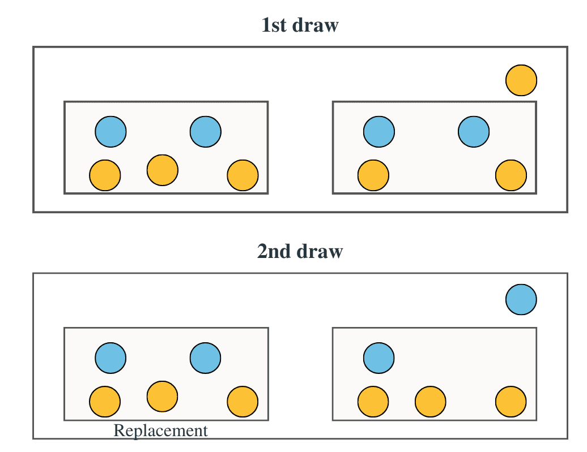

{width=1px}

What is the expected number of different values when we draw n times with replacement from the set {1, ..., n} ?

::: {.callout-tip collapse="true"}
## 💡 Hint

The number of different values can be seen as if each value has been seen at least once.
:::

::: {.callout-tip collapse="true"}
## 💡 Solution

We have $N = \sum_{k=1}^n \mathbf{1}_{\text{k drawn at least once}}.$ Thus $\mathbb{E}[N] = \sum_{k=1}^n 1-\mathbb{P}(\text{k never drawn}) = \sum_{k=1}^n 1- (1-\frac{1}{n})^n.$

Accordingly, $$\mathbb{E}[N] = n(1-(1-\frac{1}{n})^n) \approx_{n \to \infty} 0.632n$$

:::

