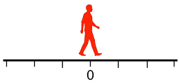

{width=1px}

Let's start at the position 0 and suppose you have two integers $a$ and $b$. You can go by one unit to the left or to the right with the same probability and the game ends when you reach one of the two position $a$ or $-b$. What is the probability that you end in a ?

::: {.callout-tip collapse="true"}
## 💡 Hint

Let $X$ be the random variable with your end position, find two values for $\mathbb{E}[X]$.
:::

::: {.callout-tip collapse="true"}
## 💡 Solution

Let $X$ be the random variable with your end position and $p_a$ the probability to end at a.

On the one hand, we have $\mathbb{E}[X] = p_aa+(1-p_a)(-b) = p_a(a+b)-b.$

On the other hand, by symmetry between going to the left or the right, we have $\mathbb{E}[X] =0.$

Therefore, $$\boxed{p_a=\frac{b}{a+b}.}$$
It is the normalized distance from 0 to -b within the range -b to a
:::

