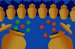

{width=1px}

Suppose we have r balls indiscernible and n urns ($r \le n$). 

What is the probability that each urn has at most one ball ?

::: {.callout-tip collapse="true"}
## 💡 Hint

Try to compute the number of different sequences of ball / urn separation that we can do.
:::

::: {.callout-tip collapse="true"}
## 💡 Solution

Let's denote by `*` the balls and by `|` the separation of the different urns. Therefore, one possibility to dispach the balls is the following `"*|*|...|*"`. Accordingly, we need to choose the right place for the separators within the sequence. 

* The total number of sequence that we can do is $\binom{n+r-1}{n-1}$ (we choose the place of the separators)

* The total number of sequence verifying that all urns have at most one ball is $\binom {n}{r}$ (we choose the urns that have exactly one ball).

Thus $\boxed{\mathbb{P}(\text{All urns have at most one ball}) = \frac{\binom {n}{r}}{\binom{n+r-1}{n-1}}= \frac{(n-1)...(n-r+1)}{(n+r-1)...(n+1)}.}$

:::

::: {.callout-tip collapse="true"}
## 🚨 Follow up

The probability that there exist one urn with at least two balls is thus $1-\mathbb{P}(\text{All urns have at most one ball}).$

Moreover, if the balls were discernible, for each ball we could choose an urn with no ball yet. We will get a different probability : $\mathbb{P}(\text{All urns have at most one ball})=\frac{n(n-1)...(n-r+1)}{n^r}.$
:::