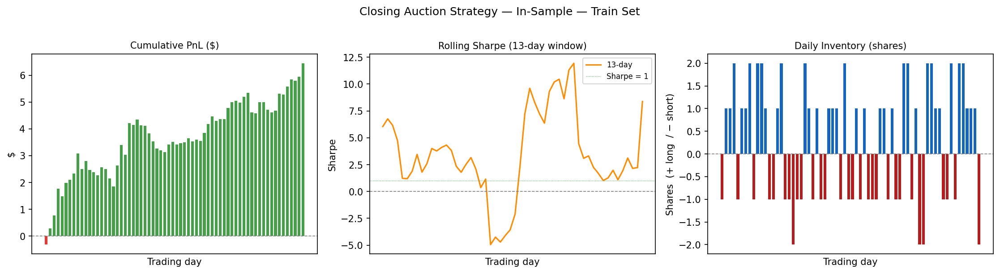
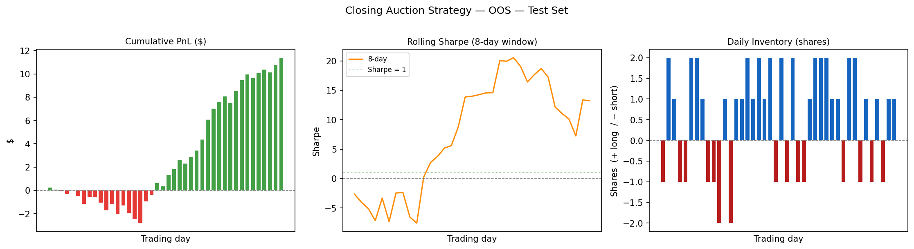
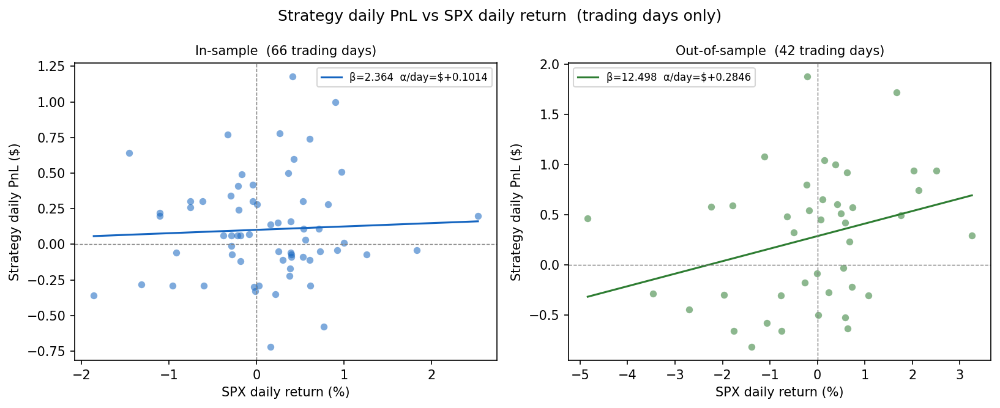

This page presents the final group project for **MGMTMFE 412 Trading, Market Frictions and FinTech** at UCLA Anderson. The project builds a short-term trading strategy around the NASDAQ closing auction on Apple (AAPL), using Level 2 order-book data to predict the direction of the price move in the last 12 minutes before the auction prints.




### The Economic Idea

Every trading day at 4:00 PM, NASDAQ sets a single official closing price by matching all Market-on-Close (MOC) orders in a batch auction. Between 25% and 30% of the entire day's volume in a stock like AAPL can clear in this one event. Institutions accumulate MOC orders throughout the day, but the official net imbalance figure is not published until 3:50 PM. Before that, the pressure from those orders has to go somewhere — and it leaves a trace in the continuous Level 2 (L2) order book.

The strategy is built on this observation. If you can read the pre-auction order-book dynamics between 3:15 and 3:45 PM — detecting which side (buy or sell) is building up more pressure — you can make a short-term directional bet in the 12-minute window before the auction clears. The trade enters at 3:45 PM and exits no later than 3:57 PM, always before the 4:00 PM print. This keeps holding time short, avoids overnight risk, and targets a structural friction rather than a news or momentum signal.

### Data

The raw data is AAPL Level 2 market-by-price (MBP-10) data from **Databento — XNAS.ITCH**, covering the top 10 bid and ask levels. The sample runs from September 27, 2024 to May 15, 2025, giving 158 trading days. The split is 90 days for training and 68 days for out-of-sample testing. AAPL is chosen specifically because of its tight spread (around 1¢ on a $220 stock, so the round-trip cost is roughly 0.9 bps) and its deep order book, both of which make a short-term L2 strategy feasible.

### The 5 Features

At each trading day, five signals are computed from the 3:15–3:45 PM window and fed into the model:

| Feature | Window | What it captures |
|---|---|---|
| `imb_early` | 3:15 – 3:35 PM | Exponential-decay depth imbalance — sustained pre-auction positioning |
| `imb_late` | 3:35 – 3:45 PM | Same measure, last 10 minutes — where late MOC flow concentrates |
| `mom_30` | Full 30 min | Microprice return over the window (in bps) — the directional anchor |
| `mom_accel` | Last 15 min | Late momentum minus full-window momentum — is the move speeding up? |
| `cancel_imb` | Full 30 min | Ask cancellations minus bid cancellations — liquidity being pulled before the auction |

All five features are standardized to zero mean and unit variance on training days only, so the model never sees future information during the OOS period.

### The Model

The model is a **Ridge regression** with regularization parameter $\alpha = 15$:

$$
\hat{y}_t = \beta_0 + \beta_{ie}\, z(\texttt{imb\_early}) + \beta_{il}\, z(\texttt{imb\_late}) + \beta_{30}\, z(\texttt{mom\_30}) + \beta_{ac}\, z(\texttt{mom\_accel}) + \beta_{ci}\, z(\texttt{cancel\_imb}).
$$

The target $\hat{y}_t$ is the predicted 12-minute microprice return in basis points. Ridge is used instead of plain OLS because with only 90 training days and 5 correlated features, OLS tends to produce very unstable coefficients. The $\alpha = 15$ penalty keeps all coefficients modest (max absolute value 3.5) and reduces the risk of overfitting the training set.

The fitted coefficients and their interpretation:

| Feature | Coefficient | Sign | What it means |
|---|---|---|---|
| Intercept | +0.46 | | Slight upward drift in the pre-close window |
| `imb_early` | +0.46 | ↑ | More bid depth early → price tends to go up |
| `imb_late` | −0.78 | ↓ | Heavy late bid depth absorbs sell-MOC flow — bearish signal |
| `mom_30` | +3.52 | ↑↑ | Dominant feature: price trending into the close tends to continue |
| `mom_accel` | +2.99 | ↑↑ | Late acceleration reinforces the trend signal |
| `cancel_imb` | −0.21 | ↓ | More ask cancellations → market makers pulling liquidity → bearish |

The in-sample $R^2$ is 0.096 (hit rate 55.6%), which is modest but meaningful for a 12-minute microstructure signal. The model is not trying to explain most of the price move — it only needs to get the sign right more often than not.

### Trade Mechanics

A trade is triggered at **3:45 PM** only if two conditions are met: (1) the predicted signal $|\hat{y}_t| \geq 1.5$ bps, which clears the transaction cost buffer; and (2) the bid-ask spread is $\leq 3$¢, confirming the market is liquid enough to fill at a reasonable price. If the signal is positive the strategy buys at the ask; if negative it sells at the bid. Orders are flat by 3:57 PM every day — no overnight exposure.

Position size is scaled by signal strength: $\text{qty} = \text{round}(|\hat{y}_t| / 3) \in [1, 5]$ shares. A weak signal of 1.5 bps gives 1 share; a strong signal above 13 bps gives 5 shares.

Exits are adaptive, checked every 15 seconds:
- **Stop-loss**: exit immediately if the position moves 12 bps against you.
- **Take-profit**: exit immediately if the position gains 22 bps.
- **Scheduled exit**: otherwise, close at 3:57 PM.

The asymmetric payoff — take-profit 22 bps vs. stop-loss 12 bps (ratio 1.83) — means the break-even win rate is 35.3%, well below the model's 55%+ hit rate.

### Results

The strategy was tested over the full 158-day sample (90 in-sample / 68 out-of-sample). The model was trained only on the in-sample period and never touched again before the OOS evaluation.

| Metric | In-Sample (90 days) | Out-of-Sample (68 days) |
|---|---|---|
| Net return (% of notional) | +2.93% | +5.18% |
| Annualized return | +8.21%/yr | +19.19%/yr |
| Annualized volatility | 2.22%/yr | 3.80%/yr |
| Sharpe ratio | 3.70 | 5.05 |
| Win rate | 54.5% (36/66) | 59.5% (25/42) |
| Max drawdown | −0.56% | −1.38% |
| Days traded / total | 66/90 | 42/68 |

Statistical significance: IS $t$-stat = 2.20 ($p$ = 0.014); OOS $t$-stat = 2.61 ($p$ = 0.005). The OOS Sharpe exceeds IS because the March–April 2025 tariff sell-off created large intraday moves in AAPL — the signal fired on high-conviction days and the per-trade PnL was larger than during the calmer training period. The 95% confidence interval on the OOS Sharpe is wide ([1.15, 8.88]), so a realistic long-run estimate of the true edge is 2–4.

The charts below show cumulative PnL, rolling Sharpe, and daily inventory for both the in-sample and out-of-sample periods:

**In-Sample Strategy Diagnostics:**

{width=100%}

**Out-of-Sample Strategy Diagnostics:**

{width=100%}

### Beta Analysis

The strategy is designed to be market-neutral by construction: a 12-minute hold barely gives the market time to move, there is no overnight exposure, and positions are flat every day at 3:57 PM.

The regression of daily strategy PnL on SPX daily returns (on trading days only) confirms this:

- **In-sample**: $\beta = +2.36$, $p = 0.667$ — not statistically different from zero, as expected.
- **Out-of-sample**: $\beta = +12.50$, $p = 0.033$, $R^2 = 8.9%$ — significantly positive, but this is a regime artifact, not a design flaw. During the March–April 2025 tariff sell-off, AAPL moved sharply ($250 → $170), and on those days the auction-flow signal and market direction happened to point the same way. The remaining 91% of OOS PnL variance is idiosyncratic alpha.

{width=100%}

### Risk and Limitations

The main risks the strategy faces are:

**Macro events during 3:45–3:57 PM.** An FOMC announcement, earnings release, or large block print after entry can overwhelm the signal and trigger the stop-loss. This is the hardest risk to hedge in a 12-minute window.

**Late MOC flip.** If a large opposing MOC order arrives late and reverses the book imbalance, the signal becomes stale. The strategy has no way to update once it enters.

**Signal decay.** The model uses a fixed set of training weights. A decay monitor flags when the trailing 30-day $R^2$ falls below 5% or the hit rate approaches the 35.3% break-even level, triggering a quarterly retrain.

**Capacity.** At the current 1–5 share size, market impact is negligible. At $10M deployment (~45K shares per trade), impact is less than 0.5 bps. The capacity wall sits at approximately $50–100M, where market impact at entry reaches the 1.5 bps signal threshold and begins eroding the edge.

**Sample size.** The OOS period is 42 trading days — enough to compute statistics, but a single historical path. The confidence intervals on Sharpe differences are wide, and generalisation to other tickers has not been tested.
