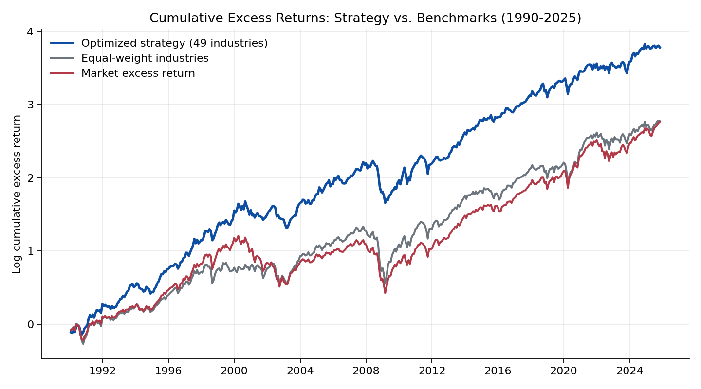
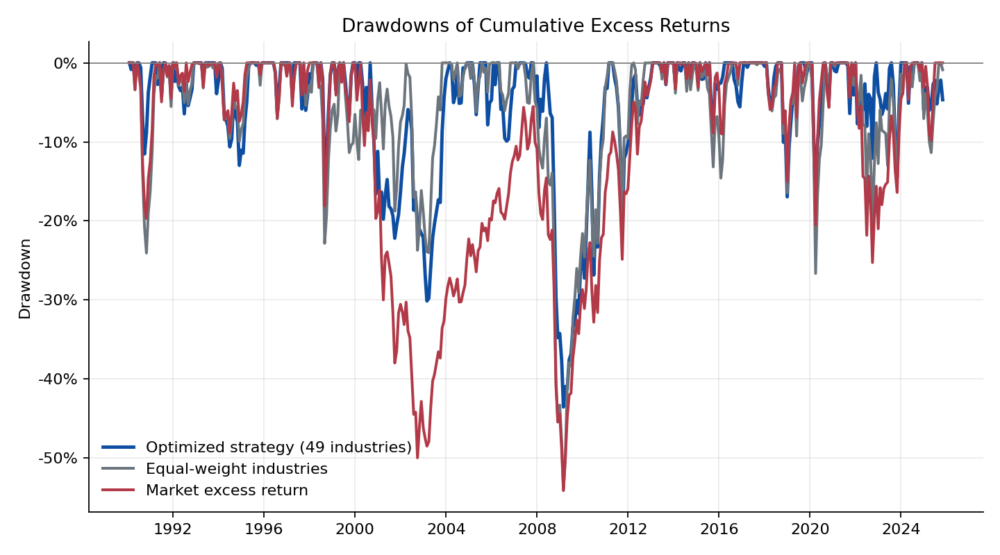
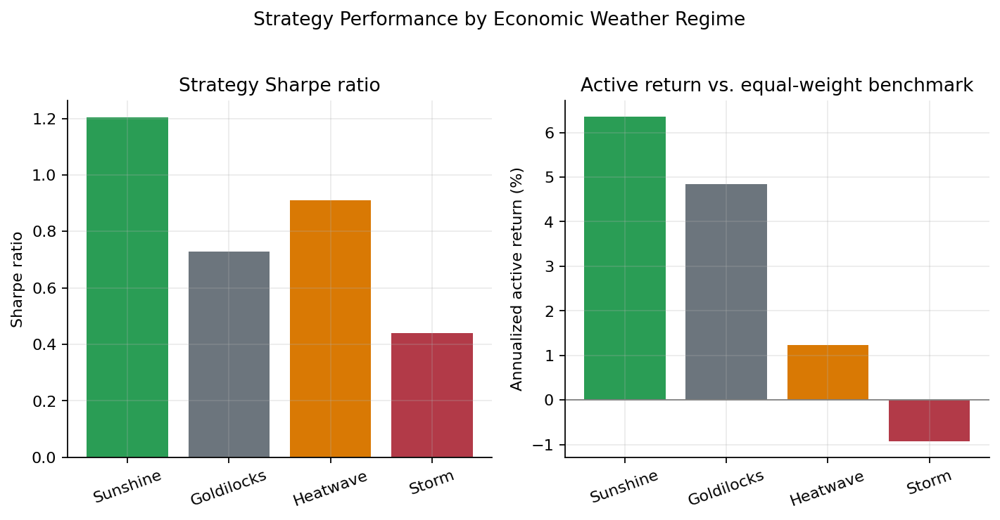

As the final group project for **MGMTMFE 431 Quantitative Asset Management** at UCLA Anderson, this project designs and backtests a monthly industry-rotation strategy on the Ken French 49 Industry Portfolios. The core idea is to treat industries as `economic habitats`: groups of firms that respond differently to the macro `weather` — the state of growth, inflation, and the yield curve. We combine an eight-factor risk model, an industry momentum signal, and a macro regime classification (the `Economic Weather` overlay) inside a constrained benchmark-relative optimizer, and backtest the result out-of-sample from January 1990 through October 2025.




### Strategy: factor model and expected returns

At each month-end $t$, the strategy uses the prior 120 months of data to estimate, for every industry $i$, an augmented factor model on an eight-factor set $f_\tau$ — the Fama-French five factors (`Mkt-RF, SMB, HML, RMW, CMA`), Ken French `Momentum`, and the AQR `Quality Minus Junk` and `Betting Against Beta` factors:

$$
r_{i,\tau}^{e} = \alpha_i + \beta_i' f_\tau + \epsilon_{i,\tau}.
$$

The expected excess return that feeds the optimizer combines four ingredients:

$$
\hat{\mu}_{i,t} = \tilde{\alpha}_{i,t} + \hat{\beta}_{i,t}'\tilde{f}_t + 0.012\, z(\text{MOM}_{i,t}) + \omega_{i,t}^{\text{weather}}.
$$

Here $\tilde{\alpha}_{i,t}$ is the industry's factor-model intercept after cross-sectional shrinkage, so a handful of noisy outlier alphas can't dominate the ranking. $\tilde{f}_t$ is a forecast of next month's factor premia, blending historical factor means with ridge regressions on lagged FRED macro variables — the term spread, unemployment, industrial production growth, and inflation. $\text{MOM}_{i,t}$ is the industry's 12-month return skipping the most recent month, entered as a `cross-sectional z-score`. The last term, $\omega_{i,t}^{\text{weather}}$, is the Economic Weather overlay described next.

### The economic weather overlay

The distinguishing feature of the project is the weather classification, which uses only information available at time $t$ — no look-ahead — to bucket every month into one of four regimes:

| Weather | Macro condition | Industries favored |
|---|---|---|
| `Sunshine` | Strong industrial production growth, stable labor market | Cyclicals, technology, household-beta names |
| `Goldilocks` | No extreme macro pressure | Networks, household beta, selected cyclicals |
| `Heatwave` | Inflation above its rolling median and rising short rates | Extractors, utilities, inflation-sensitive industries |
| `Storm` | Inverted yield curve or rising unemployment | Defensive shelter industries |

Each regime feeds the optimizer in three ways: through the return overlay $\omega^{\text{weather}}$ itself, an economic prior over which industries should outperform; through the active weight caps $c_{i,t}$ (24% for favored industries, 20% for neutral ones, 14% for disfavored ones); and through the risk-aversion parameter $\gamma_t$ — `0.90` in sunshine, `0.97` in goldilocks, `1.03` in heatwave, and `1.15` in storms. The strategy therefore takes more active risk when the macro backdrop is supportive and pulls back when recession risk rises.

### Portfolio construction

Given $\hat{\mu}_t$ and a factor-model covariance matrix $\hat{\Sigma}_t = \hat{B}_t \hat{\Sigma}_{f,t}\hat{B}_t' + \hat{D}_t$ — with a small shrinkage toward a diagonal target for numerical stability — the strategy solves a benchmark-relative active mean-variance problem against the equal-weight industry benchmark $b$:

$$
\max_w \;\; w'\hat{\mu}_t - \frac{\gamma_t}{2}(w-b)'\hat{\Sigma}_t(w-b)
\quad \text{s.t.} \quad \sum_i w_i = 1, \;\; 0 \le w_i \le c_{i,t}.
$$

The optimizer also scans a grid of risk-aversion levels and keeps the combination with the best ex-ante Sharpe ratio / information ratio trade-off.

### Backtest results

The optimized 49-industry strategy earns an annualized excess return of `11.75%` with `15.20%` volatility, for a Sharpe ratio of `0.77` — comfortably ahead of both the equal-weight industry benchmark (`0.57`) and the market excess return (`0.59`) over the same 1990-2025 sample.

{width=100%}

The chart above plots log cumulative excess returns. The strategy's edge is not concentrated in a single episode: it compounds at roughly the same slope as the benchmarks during calm periods but recovers faster after the major drawdowns, most visibly after the dot-com bust and the 2008 financial crisis.

| Portfolio | Ann. excess return | Ann. volatility | Sharpe ratio | Max drawdown |
|---|---|---|---|---|
| Optimized strategy (49 industries) | 11.75% | 15.20% | 0.77 | -43.5% |
| Equal-weight 49 industries | 9.06% | 16.04% | 0.57 | -54.0% |
| Market excess return | 8.93% | 15.24% | 0.59 | -54.1% |
| 10-industry robustness check | 10.56% | 14.36% | 0.74 | -39.8% |

{width=100%}

The drawdown chart makes the risk-control case clearer than the return chart alone: the strategy's worst drawdown (`-43.5%`) is roughly ten percentage points shallower than either benchmark (`-54%`), even though its market beta is close to one (`0.98`). Most of that gap opens up during 2000-2003 and 2008-2009, periods when the weather overlay spends more time in `Storm`, tightening the caps on cyclical and balance-sheet-sensitive industries.

### Reading the weather

{width=100%}

Splitting the sample by regime shows that the classification is doing real work rather than adding noise. The strategy's Sharpe ratio is highest in `Sunshine` (`1.20`) and `Heatwave` (`0.91`), moderate in `Goldilocks` (`0.73`), and lowest in `Storm` (`0.44`) — and the active return versus the equal-weight benchmark follows the same ordering, turning slightly negative (`-0.9%` annualized) in storms. This is economically sensible: storm months combine an inverted yield curve with rising unemployment, exactly the environment where cross-sectional equity bets are hardest to time, so the strategy's relative edge shrinks even as its absolute defensiveness — lower caps on cyclicals — helps contain the drawdown.

### Robustness, costs, and limits

A few checks temper the headline number. The strategy's Fama-French six-factor alpha is small and statistically insignificant (`-0.18%` annualized, t-stat `-0.17`) with a market beta of `0.98`, so the gain is better read as `disciplined timing and allocation` across factor, momentum, quality, and defensive exposures than as a standalone pricing anomaly. Average one-way turnover is `27.9%` per month; even at `25 bps` of one-way transaction costs, the net Sharpe ratio only falls to `0.72`. The result is also not free of regime dependence across calendar time: the strategy posts Sharpe ratios of `1.16` (1990s) and `1.03` (2010s) but only `0.34` (2000s) and `0.54` (2020-2025) — strong on average, but not in every decade. Finally, repeating the whole construction on the broader Ken French `10-industry` set gives a Sharpe ratio of `0.74` with lower volatility and a smaller drawdown, which suggests the core idea is not an artifact of the finer 49-industry split.

The full derivations, factor regressions, and turnover/cost tables are in the report above; the slides walk through the same material in presentation form.
