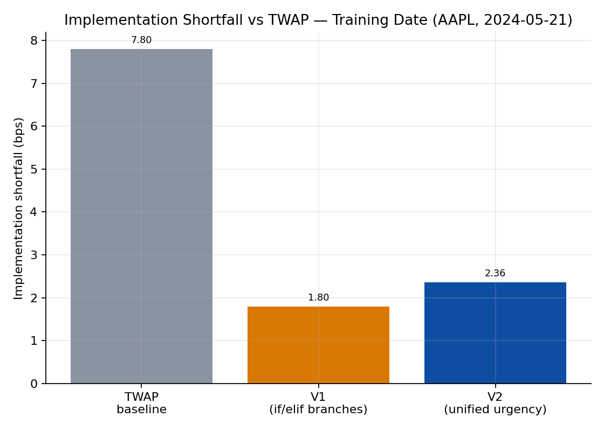
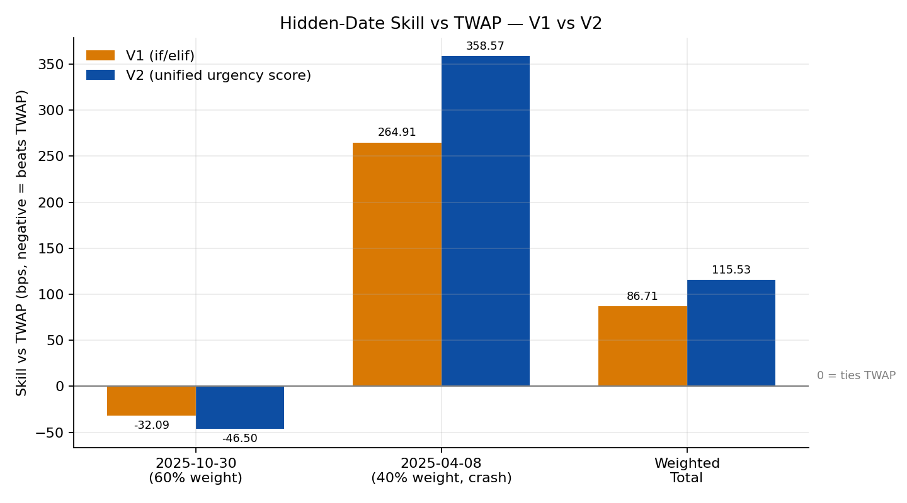
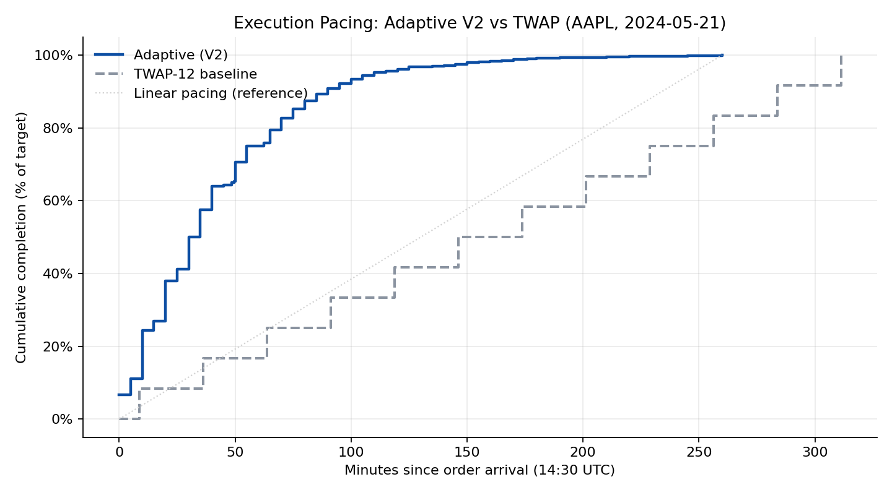

This page documents the executor assignment from **MGMTMFE 412: Trading, Market Frictions, and FinTech** at UCLA Anderson: build an algorithm that buys \$10,000,000 of `AAPL` between 14:30 and 20:00 UTC, minimizing implementation shortfall (IS) relative to the arrival mid-price, and have it graded against a TWAP-12 starter strategy on hidden out-of-sample dates. As with the trader pages, every version of the code was developed together with **Claude (Anthropic)**: I supplied the assignment brief, the previous version's code, and the instructor's feedback, and Claude proposed and implemented the execution logic, which I then tested locally and submitted. All figures below come from the autograder's `summary.json` / `twap_comparison.csv` outputs and the instructor's feedback reports.

### The benchmark: TWAP-12

The starter strategy slices the order into 12 equal market orders spread evenly across the 5.5-hour window. On the training date (2024-05-21) it completes 99.98% of the order (52,022 of a 52,022-share target) at an average fill price of \$192.3749, for an implementation shortfall of **7.80 bps / \$7,799.55**. Beating this benchmark — not in absolute terms, but in the `skill_bps = student_SF - TWAP_SF` sense defined by the grader — is the entire game.

### V1: segment-voting momentum with if/elif branching

V1 is a 5-minute clock-bucket executor. At each checkpoint it computes a *segment-voting momentum* signal — the 15-minute lookback is split into three independent 5-minute sub-windows, each compared against a smoothed mid-price anchor, and a trade direction is confirmed only if at least 2 of 3 sub-windows agree (with a `min_valid_segments=3` guard to avoid false signals in the first 15 minutes). This vote is combined with an L1 book-imbalance multiplier and a spread-aware limit/market order selector, on top of a geometric-decay base schedule (`remaining_qty × dynamic_frac`) that naturally front-loads execution.

On the training date this scored **1.80 bps** — a huge improvement over TWAP's 7.80 bps, since front-loading is exactly the right thing to do on an uptrend day (buy before the price rises further). But the decision logic was a stack of hard-coded `if/elif` branches with discrete multipliers (2x / 1.3x / 0.6x), which the instructor's feedback flagged as the strategy's central weakness: "what is missing is the guide's unified urgency score... the student uses separate if/elif branches... rather than a single linear combination that allows all signals to interact continuously."

Before committing to V1's signal set, I ran an empirical accuracy comparison of L1 vs. L2 directional signals on the training date, at both 1-minute and 5-minute horizons:

| Signal | 1-min accuracy | 5-min accuracy |
|---|---|---|
| L1 static imbalance | 47.5% | **55.4%** |
| L2 static imbalance (10 levels) | 34.4% | 44.9% |
| L2 depth-weighted microprice | 32.8% | 45.3% |
| Multi-level order-flow imbalance (Cont et al., 2014) | **47.7%** | — |

L2 signals were *worse than random* at the 5-minute checkpoint horizon for AAPL — the instructor's read is that "HFT market-maker quoting dominates levels 1-9," so depth beyond the top of book is mostly noise for a 5-minute decision cadence. That result is why both V1 and V2 stayed L1-only by design.

Two alternatives were tried and rejected before settling on the geometric-decay + signal-multiplier design. A pure VWAP-tracking schedule gave **9.70 bps** — *worse* than TWAP, because on an uptrend day VWAP "back-loads into peak prices." A fixed-fraction schedule (`BASE_FRACTION=0.07` applied uniformly, no signals at all) gave **1.05 bps** — the best in-sample number of any variant — but was rejected as overfit to a single uptrend training day with no adaptive mechanism for a different regime.

### V2: a unified urgency score

The redesign replaced the if/elif tree with a single continuous urgency score combining five normalized signals:

$$
u_t = 0.40\,\text{deficit}_{\text{norm}} + 0.25\,\text{drift}_{\text{norm}} + 0.20\,\text{imb}_{\text{norm}} + 0.15\,\text{time}_{\text{norm}}^2 - 0.10\,\text{spread}_{\text{norm}}
$$

$$
\text{multiplier} = \text{clip}(1 + u_t,\ 0.30,\ 2.50), \qquad \text{qty\_slice} = \left\lfloor \text{remaining} \times \text{BASE\_FRACTION} \times \text{multiplier} \right\rfloor
$$

The key design choice — and the explicit fix for V1's failure mode — is that `BETA_DEFICIT = 0.40` is set to *dominate* the combined bearish contribution (`BETA_DRIFT + BETA_IMB = 0.45`, but at moderate signal levels `0.40` alone still outweighs the realistic combined drag), so schedule-catch-up pressure can no longer be fully overridden by a bearish drift + imbalance read the way V1's `if/elif` chain allowed. The full parameter set:

| Parameter | Value | Parameter | Value |
|---|---|---|---|
| `CHECK_INTERVAL_SECONDS` | 300 | `BETA_DEFICIT` | 0.40 |
| `BASE_FRACTION` | 0.06 | `BETA_DRIFT` | 0.25 |
| `TREND_LOOKBACK_SEC` | 900 | `BETA_IMB` | 0.20 |
| `TREND_THRESHOLD_BPS` | 1.0 | `BETA_TIME` | 0.15 |
| `min_valid_segments` | 3 | `BETA_SPREAD` | 0.10 |
| `IMB_THRESHOLD` | 0.05 | `URGENCY_MULT_MIN` | 0.30 |
| `COMPLETION_WINDOW_FRAC` | 0.20 | `URGENCY_MULT_MAX` | 2.50 |
| `SPREAD_LIMIT_THRESHOLD_BPS` | 0.80 | | |
| `TIME_LIMIT_MAX_FRAC` | 0.65 | | |

On the training date, V2 scores **2.36 bps** in the current local evaluation (2.46 bps was the figure during development, before minor post-write-up tuning) — *slightly worse* than V1's 1.80 bps. That in-sample regression was accepted deliberately, on the bet that a continuous, principled urgency score would generalize better than a brittle if/elif tree.

{width=100%}

### Hidden-date results: a genuine trade-off, not a clean win

The grader's `skill_bps = student_SF - TWAP_SF`, with the convention that **negative skill means the student beat TWAP** and positive skill means TWAP won. Reading the two hidden dates with that sign convention in mind:

| Hidden date (weight) | TWAP SF | V1 student SF | V1 skill | V2 student SF | V2 skill |
|---|---|---|---|---|---|
| 2025-10-30 (60%) | 81.87 bps | 49.78 bps | -32.09 bps | 35.37 bps | **-46.50 bps** |
| 2025-04-08 (40%, crash) | -516.84 bps | -251.93 bps | +264.91 bps | -158.27 bps | +358.57 bps |
| **Weighted** | — | — | **+86.71 bps** | — | **+115.53 bps** |

{width=100%}

V2 *did* improve on the calm/up day (2025-10-30): it beat TWAP by 46.50 bps versus V1's 32.09 bps. But on the actual crash day in the hidden set (2025-04-08), V2 underperformed TWAP by 358.57 bps — *more* than V1's 264.91 bps underperformance. Both versions lose to TWAP on this date because TWAP's even pacing keeps buying all the way to the close, capturing more of a day-long price decline than either front-loaded strategy; V2's `BETA_DEFICIT`-dominance fix, by design, keeps it closer to its front-loaded base schedule even when the drift signal turns bearish, so it ends up *more* front-loaded than V1 on this date — and therefore captures even less of the decline. Because the crash day carries 40% of the weight, the net weighted skill got slightly *worse* (+86.71 → +115.53, where larger positive numbers mean "loses to TWAP by more"), and the instructor's final grade moved from **96.0/100 (V1) to 93.2/100 (V2)**. "No lookahead detected" held for both submissions.

The pacing chart below — built from the current code's actual fill timestamps on the training date — shows just how front-loaded V2 is in practice: it reaches roughly 90% completion within about two hours of the 14:30 arrival, versus TWAP's even 12-slice pacing across the full 5.5-hour window.

{width=100%}

### Limits

The headline result here is not "V2 beat V1" — on the hidden dates it didn't, and the grade reflects that. What V2 *did* do is replace a brittle architecture (hard-coded if/elif branches that the instructor identified as a structural risk) with a principled, continuous formulation whose failure mode is at least legible: it is structurally biased toward front-loading, which is correct on trending-up days and on the 2025-10-30 hidden date, but costly on the one genuine crash day in the hidden set. Two concrete gaps remain, both flagged directly in the feedback. First, the drift component is still a hand-crafted segment-voting heuristic, not the regression-based signal the course guide specifies — fitting $r_{t,t+h} = a + b_1 \cdot \text{imbalance} + b_2 \cdot \text{microprice\_gap} + b_3 \cdot \text{recent\_return}$ on a rolling window of past observations would replace the hard-coded 1.0 bps threshold with data-driven coefficients and add a microprice-gap signal that's currently absent entirely. Second, the urgency score has no depth-cost term: with $u_t$ missing a $-\beta_5 \cdot \text{depth\_cost}$ component, the strategy never slows down when the best ask is thin, even though an L1-only proxy (`qty_this_slice / ask_sz_00`, capped to a 10-20% participation rate) would be straightforward to add. Either change would also give the strategy a principled way to *reduce* front-loading specifically when the order book signals it's expensive to do so — which is precisely the lever that's missing from the current trade-off between the two hidden dates.
