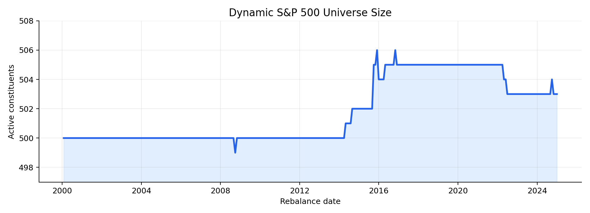
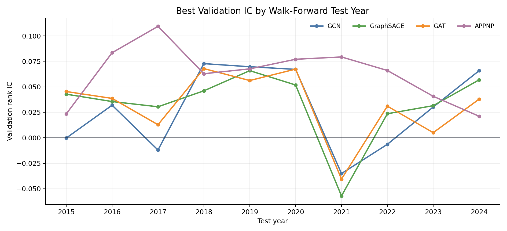
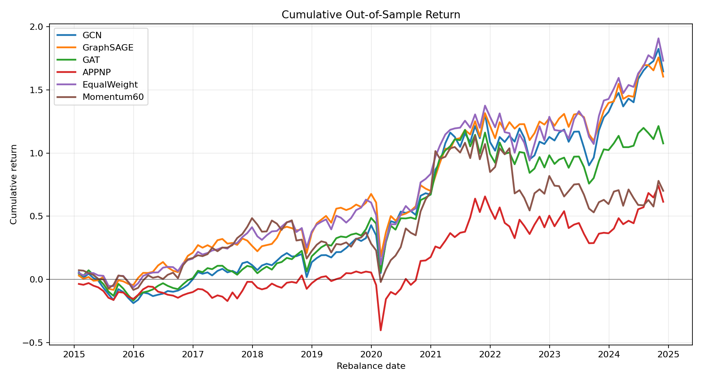
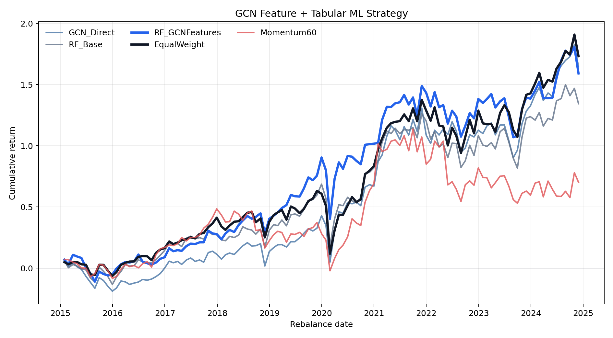
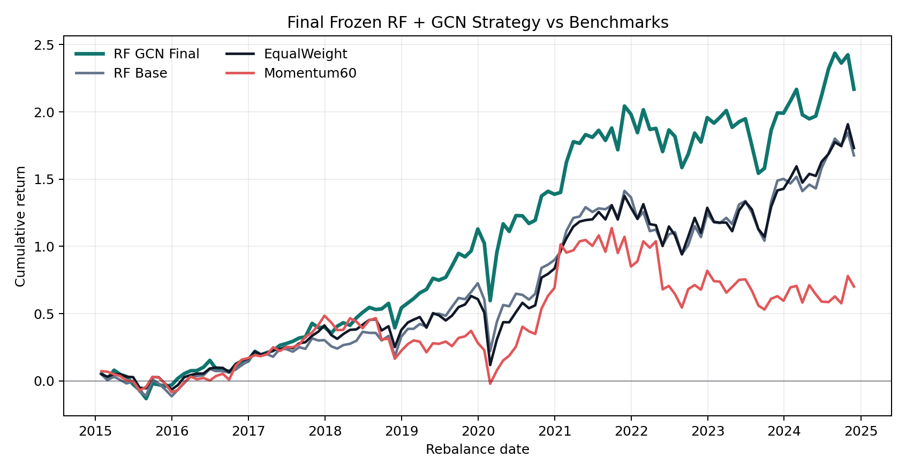
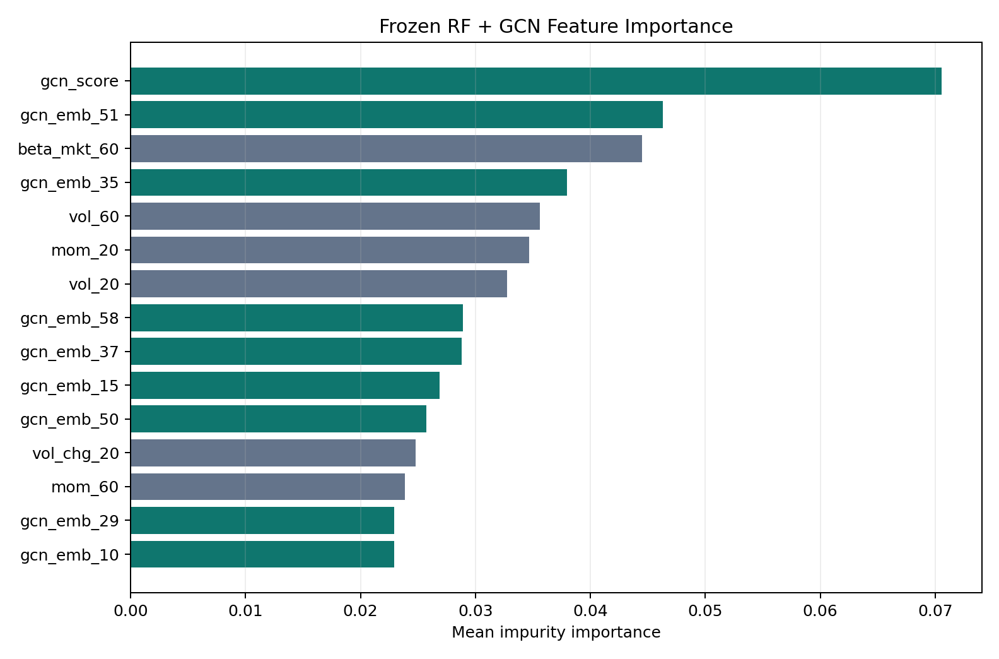

This page presents a group project from the **Machine Learning and Data Analytics** course at UCLA Anderson. The central question is whether graph neural networks can improve portfolio construction on a dynamic S&P 500 universe. The data come from WRDS/CRSP daily stock files and historical S&P 500 membership records, covering 1,110 distinct PERMNOs over 4,788,231 daily rows. The investable universe is rebuilt every month from *active* index constituents (499–506 stocks per month), so the study mitigates the survivor-only bias that would arise from selecting today's index members and backfilling them through history. The out-of-sample period runs from 2015-01-30 to 2024-11-29, spanning 119 monthly rebalances — enough for a meaningful but still single-path evaluation.

The research design unfolds in three stages. Stage 1 asks whether a GNN score alone can rank stocks well enough to build a competitive portfolio. Stage 2 changes the role of the GNN: rather than a direct portfolio model, the GCN is used as a graph-aware feature extractor whose outputs are fed into a Random Forest rank model. Stage 3 freezes the best configuration found in Stage 2 — before OOS evaluation, with no annual model switching — and reports the final result.

The headline OOS numbers (119 monthly rebalances, 10 bps transaction cost per unit of turnover) are:

| Strategy | Ann. Return | Ann. Vol. | Sharpe | Max DD | Turnover |
|---|---|---|---|---|---|
| RF + GCN Final | 12.33% | 18.24% | 0.676 | -24.99% | 1.60 |
| RF Base | 10.44% | 18.28% | 0.571 | -29.25% | 1.71 |
| EqualWeight | 10.66% | 18.06% | 0.590 | -31.48% | 0.02 |
| Momentum60 | 5.50% | 20.14% | 0.273 | -34.10% | 1.29 |

The main conclusion is not that GNNs universally beat tabular models. It is more specific: *direct* GNN portfolios are mixed and do not consistently dominate EqualWeight, but GCN *representations* — a scalar score plus a 64-dimensional embedding per stock — add useful relational information to a conventional RF model, improving Sharpe and maximum drawdown relative to RF Base, EqualWeight, and Momentum60.

### Data and dynamic graph construction

At each monthly rebalance date $t$, the investable set is reconstructed from active S&P 500 constituents. Stocks are identified by CRSP PERMNO rather than ticker, avoiding look-ahead from ticker changes and share-class reuse. The universe size stays close to 500 names throughout the sample, with minor variation from entries, deletions, and share-class mechanics:

{width=100%}

Each stock's node feature vector contains six price-volume signals known at date $t$:

$$
x_{i,t} = [\text{Mom}_{20},\, \text{Mom}_{60},\, \text{Vol}_{20},\, \text{Vol}_{60},\, \Delta\text{Volume}_{20},\, \beta_{\text{MKT},60}].
$$

Momentum is computed from adjusted prices, volatility is the rolling standard deviation of daily returns, volume change captures short-run trading attention, and beta is estimated against an equal-weight market proxy in a leave-one-out style so that a stock's own return does not mechanically enter its benchmark. All signals are standardized cross-sectionally at each rebalance date. The prediction target is the next-20-trading-day forward return with a one-day execution lag:

$$
y_{i,t} = \frac{P_{i,t+21}}{P_{i,t+1}} - 1.
$$

The one-day lag avoids using the signal-date close as both the information set and the execution price. At each rebalance date, the correlation graph $G_t = (V_t, E_t, A_t)$ is rebuilt from the most recent 60 daily returns. Each stock keeps its top $k = 10$ positively correlated neighbors:

$$
A_{ij,t} = \begin{cases} \rho_{ij,t}^{(60)}, & j \in \text{TopK}_{10}^+(i,t), \\ 0, & \text{otherwise.} \end{cases}
$$

The graph is therefore sparse, dynamic, and entirely data-driven — it captures changing market relationships (sector rotation, crowding, macro regime) rather than a fixed industry taxonomy.

### GNN message-passing models

Four GNN architectures are evaluated as direct portfolio models. Let $H_t^{(0)} = X_t \in \mathbb{R}^{N_t \times F}$ be the node feature matrix and $G_t$ the dynamic stock graph. Each model outputs one score per stock used for cross-sectional ranking.

**GCN** adds self-loops $\tilde{A} = A + I$ and normalizes by degree $\tilde{D}_{ii} = \sum_j \tilde{A}_{ij}$:

$$
H^{(\ell+1)} = \phi\!\left(\tilde{D}^{-1/2}\tilde{A}\tilde{D}^{-1/2}H^{(\ell)}W^{(\ell)}\right).
$$

GCN performs conservative neighborhood smoothing, which is valuable in a low signal-to-noise environment: noisy individual stock labels are averaged over correlated neighbors that share sector, style, or macro exposures, reducing variance at the cost of some per-stock expressiveness.

**GraphSAGE** separates a stock's own representation from an aggregated neighbor mean, making it naturally suited to a dynamic universe where the node set changes every month:

$$
m_i^{(\ell)} = \frac{1}{|\mathcal{N}(i)|}\sum_{j \in \mathcal{N}(i)} h_j^{(\ell)}, \qquad h_i^{(\ell+1)} = \phi(W_s h_i^{(\ell)} + W_n m_i^{(\ell)}).
$$

**GAT** learns neighbor-specific attention weights from feature similarities, allowing the model to up-weight the most informative neighbors. It is more expressive than GCN but carries higher estimation risk from noisy monthly labels.

**APPNP** decouples feature transformation from graph propagation: it first computes an MLP seed $Z = f_\theta(X)$, then performs personalized PageRank-style diffusion $H^{(r+1)} = (1-\alpha)\hat{A}H^{(r)} + \alpha Z$. The teleport term $\alpha Z$ prevents excessive drift from the per-stock signal.

All four architectures are trained with a pairwise ranking loss $\mathcal{L} = \frac{1}{|\mathcal{P}|}\sum_{(i,j)\in\mathcal{P}}\log(1 + \exp[-s_{ij}(\hat{y}_{i,t} - \hat{y}_{j,t})])$ where $s_{ij} = \text{sign}(y_{i,t} - y_{j,t})$. Validation uses cross-sectional rank IC (Spearman correlation between predicted scores and realized forward returns).

### Walk-forward backtest protocol

The backtest uses yearly walk-forward retraining. For test year $Y$, models train on historical snapshots through $Y-2$, validate on $Y-1$, and test on $Y$. This prevents using future validation information to choose a model for an earlier test year. Monthly returns are non-overlapping: the portfolio enters one trading day after the signal date and exits at the next rebalance entry date. All model-based strategies hold long-only top 20 stocks, equal-weight, with 10 bps transaction cost per unit of absolute turnover. EqualWeight holds all 500 active constituents; Momentum60 ranks by 60-day past return and also takes the top 20. The validation IC traces by test year show modest but consistent signals for GCN and GraphSAGE, with a notable dip around 2021 — the post-COVID regime shift — across all architectures:

{width=100%}

### Stage 1: direct GNN portfolio models

The first experiment asks whether GNNs alone are reliable enough as portfolio managers. The answer is mixed:

| Strategy | Ann. Return | Ann. Vol. | Sharpe | Max DD | Turnover |
|---|---|---|---|---|---|
| GCN | 10.31% | 18.99% | 0.543 | -26.54% | 1.64 |
| GraphSAGE | 10.14% | 17.16% | 0.591 | -29.56% | 1.66 |
| GAT | 7.65% | 18.59% | 0.411 | -28.62% | 1.60 |
| APPNP | 4.95% | 24.19% | 0.204 | -43.88% | 1.61 |
| EqualWeight | 10.66% | 18.06% | 0.590 | -31.48% | 0.02 |
| Momentum60 | 5.50% | 20.14% | 0.273 | -34.10% | 1.29 |

GCN and GraphSAGE produce positive OOS Sharpe ratios and competitive returns, but neither clearly dominates EqualWeight — GraphSAGE matches its Sharpe at 0.591 vs 0.590 while running 1.66 monthly turnover versus EqualWeight's near-zero 0.02. GAT is weaker, and APPNP collapses to a Sharpe of 0.204 and a -43.88% maximum drawdown. The cumulative return chart makes the instability concrete: APPNP's 2020 drawdown is severe enough to permanently impair the strategy's trajectory:

{width=100%}

Adding 10 more features (medium- and long-term momentum, downside volatility, idiosyncratic volatility, a 126-day beta, and volume surge) does not fix the problem. GCN deteriorates sharply to 0.193 Sharpe; GraphSAGE also falls; only GAT improves slightly. The "more features solves it" hypothesis does not hold here. The Stage 1 conclusion is that direct GNN scores are architecture-sensitive, subject to high turnover, and not reliable enough as a standalone portfolio engine. This motivates a role change: use GNNs to create relational representations, then let a tabular model perform the final ranking.

### Stage 2: GCN as a feature extractor for Random Forest

Stage 2 keeps the GCN but changes what it delivers. After training, the GCN produces two outputs per stock at each rebalance: a scalar ranking score $\hat{y}_{i,t}^{\text{GCN}}$ and a 64-dimensional hidden embedding $h_{i,t}^{\text{GCN}}$. These are concatenated with the original six stock features to form an augmented input:

$$
z_{i,t} = \left[x_{i,t} \,\|\, \hat{y}_{i,t}^{\text{GCN}} \,\|\, h_{i,t}^{\text{GCN}}\right], \qquad \hat{s}_{i,t}^{\text{RF}} = f_{\text{RF}}(z_{i,t}).
$$

The RF target is the within-month rank transform of realized forward returns, $q_{i,t} = \text{rank}_{i \in V_t}(y_{i,t})/N_t - 0.5$, which matches the ranking objective without requiring calibrated return forecasts. RF handles nonlinear feature interactions and threshold effects that a GCN's linear message-passing cannot model; the GCN contributes a denoised, graph-smoothed summary of each stock's relational context.

| Strategy | Ann. Return | Ann. Vol. | Sharpe | Max DD | Turnover |
|---|---|---|---|---|---|
| RF Base | 8.97% | 18.87% | 0.475 | -29.79% | 1.69 |
| RF + GCN Features | 10.07% | 18.10% | 0.557 | -26.32% | 1.61 |
| GCN Direct | 10.31% | 18.99% | 0.543 | -26.54% | 1.64 |
| EqualWeight | 10.66% | 18.06% | 0.590 | -31.48% | 0.02 |
| Momentum60 | 5.50% | 20.14% | 0.273 | -34.10% | 1.29 |

RF + GCN Features raises Sharpe from 0.475 to 0.557 — a +0.082 lift — and reduces maximum drawdown by 3.47 percentage points relative to RF Base. In the expanded 10-feature setting, the RF standalone reaches only Sharpe 0.370, while RF + GCN Features reaches 0.606, reinforcing the interpretation that the extra tabular features introduce noise when used independently but that GCN graph-smoothing can partially denoise and contextualize them. Nevertheless, the 10-feature final strategy does not beat the 6-feature final strategy, so the project keeps the original six features for robustness and interpretability:

{width=100%}

### Stage 3: frozen RF + GCN final strategy

The final strategy is deliberately frozen before OOS evaluation. The pipeline is fixed as: six original features → GCN score and 64-dimensional embeddings → five-seed RF ensemble → long-only equal-weight top 20 selection → 10 bps transaction costs. The five-seed ensemble averages RF predictions across five random draws, reducing sensitivity to a single bootstrap sample:

$$
\hat{s}_{i,t}^{\text{ens}} = \frac{1}{M}\sum_{m=1}^{M} \hat{s}_{i,t}^{(m)}, \qquad M = 5.
$$

Freezing means no annual hyperparameter selection, no monthly rule switching, and no after-the-fact model choice across the OOS period. Three implementation variants were also tested (EqualTop20, BufferTop20 with a 30-name holding buffer, and VolTop20 with inverse-volatility weights) but none of them improved the return-risk trade-off enough to replace the seed-ensemble design.

{width=100%}

The final strategy achieves 12.33% annualized return, 0.676 Sharpe, and -24.99% maximum drawdown — improvements of +1.89 pp return, +0.105 Sharpe, and +4.26 pp on maximum drawdown relative to RF Base. GCN-derived variables are prominent in the RF's feature importance: `gcn_score` is the single most important input (mean impurity importance 0.07), followed by `gcn_emb_51`, `beta_mkt_60`, `gcn_emb_35`, and `vol_60`. Multiple GCN embedding dimensions rank alongside traditional price-volume signals, supporting the interpretation that the graph representation adds information not already contained in momentum, volatility, and beta alone:

{width=100%}

### Limits

Several important caveats apply. The OOS period covers 119 monthly rebalances, which is useful but still one historical path: the confidence intervals on Sharpe ratio differences at this sample size are wide, and the outperformance relative to EqualWeight at 10 bps transaction costs becomes fragile at 20 bps — RF + GCN Final falls to Sharpe 0.560 while EqualWeight barely moves to 0.589. The active strategy runs average monthly turnover of 1.60 versus EqualWeight's near-zero turnover, so implementation costs matter more than they appear in a headline Sharpe comparison.

The graph structure itself is limited to rolling pairwise correlations. Sector classifications, fundamentals, macro variables, and options information are all excluded; the correlation edges can change rapidly across regimes, and expressive attention mechanisms like GAT may overfit short-lived co-movement patterns rather than structural dependencies. Market impact, borrow constraints, and shorting costs are not modeled — the strategy is long-only, but its portfolio concentration (top 20 names) and turnover rate would generate non-trivial impact costs in live trading that the 10 bps flat-rate assumption does not capture.

Finally, EqualWeight is a genuinely hard benchmark because it has near-zero turnover and broad market exposure. The RF + GCN strategy improves Sharpe and maximum drawdown relative to it, but the cost-adjusted return advantage over a simple buy-and-hold of the S&P 500 equal-weight index is modest enough that the project is best read as academic evidence for graph-aware representation value rather than a production-ready trading system.

