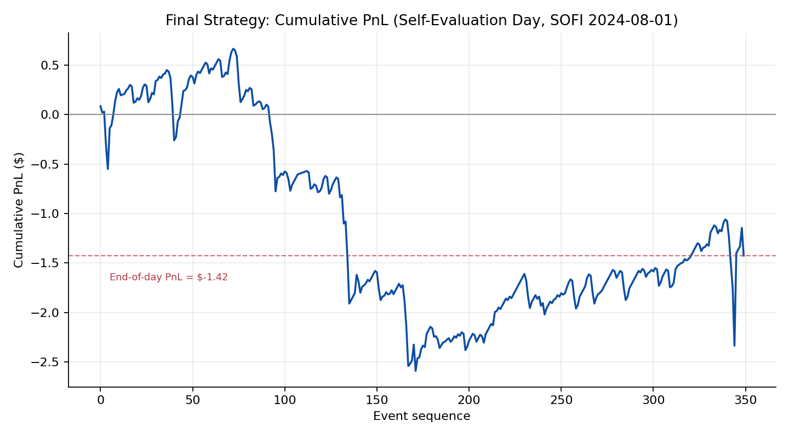
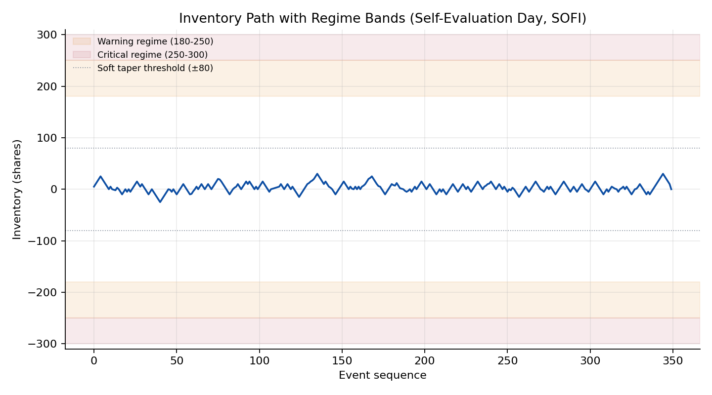
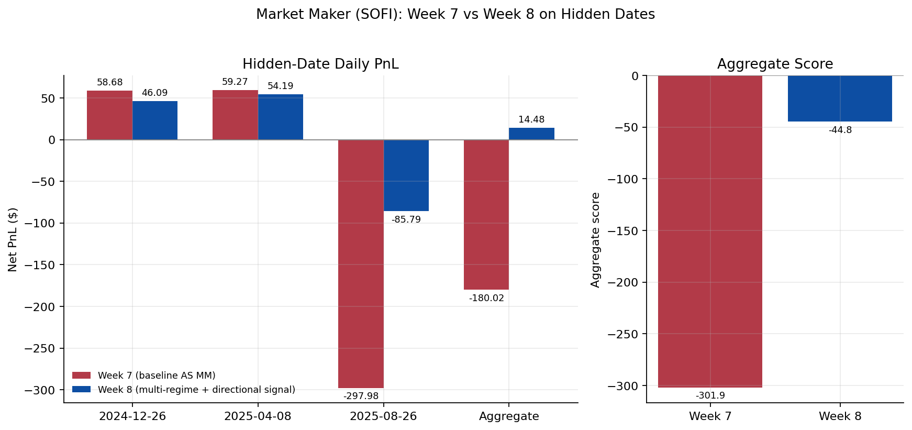

This page documents the market-making assignment from **MGMTMFE 412: Trading, Market Frictions, and FinTech** at UCLA Anderson: maintain a two-sided quote on `SOFI` using a callback API (`build_strategy` → `on_market_event` / `on_fill`) against full L3 order-book data, graded on three hidden out-of-sample dates by

$$
\text{Score}
= \text{NetPnL}
- 0.20\,\overline{\lvert q \rvert}
- 50\,(0.30 - \text{two-sided ratio})^{+}
- 10\,\text{market orders}
- 25\,\text{violations}.
$$

As with the other strategies, the code was developed iteratively with **Claude (Anthropic)**: I supplied the assignment brief, the previous week's code, and the instructor's feedback, and Claude proposed and implemented the quoting logic, which I then tested locally before submission. All figures below come from the autograder's `summary.json` outputs and the instructor's feedback reports.

### Week 7 baseline: a Avellaneda-Stoikov quoter, and where it breaks

The week-7 submission implements a linear inventory-skewed reservation price, $r = \text{mid} - 0.10 \cdot q \cdot \text{tick}$, quoting 10 shares on each side with a 1-tick half-spread. Its main engineering contribution is a *safe-cancel* guard — only cancel an order that is provably behind the NBBO (a resting sell above the current ask, or a resting buy below the current bid) — combined with a two-level throttle: Level 1 immediately resubmits only the side that just got filled, while Level 2 refreshes both sides every 150 events. An inventory taper linearly reduces the accumulating side's size as $|q|$ grows from 150 to 300 shares.

On the hidden dates this scored an aggregate **-301.9**, with net PnL of **-\$180.02**, a two-sided quote coverage of only 0.45 (below the 0.30 penalty threshold is fine, but barely), and **1 violation**:

| Date | PnL | Drawdown | Score | Fills | Violations |
|---|---|---|---|---|---|
| 2024-12-26 | \$58.68 | -\$35.09 | 24.72 | 126 | 0 |
| 2025-04-08 | \$59.27 | -\$161.22 | 22.33 | 291 | 0 |
| 2025-08-26 | -\$297.98 | -\$307.52 | -348.94 | 857 | 1 |
| **Aggregate** | **-\$180.02** | **-\$307.52** | **-301.9** | — | **1** |

The first two dates were fine; 2025-08-26 was a collapse, single-handedly producing nearly all of the aggregate loss and the only violation. The instructor's review traced this to three compounding issues: the safe-cancel guard prevents *race* violations but doesn't address *adverse selection* — the actual driver of the 2025-08-26 loss; the linear skew term is effectively cosmetic because the inventory taper clamps the position near $|q|=20$ shares, well before the skew can meaningfully lean the quotes; and the fixed 150-event throttle is blind to the NBBO, so it can both refresh needlessly on a flat market and fail to react quickly enough during a fast move. The review also noted the strategy implements the *core* AS framework (reservation price, inventory skew, throttle, tapering) but is missing a microprice/OFI signal tilt (it quotes around the simple mid), implied-alpha calibration (`SKEW_K=0.10` is hand-picked), endgame flatten logic, and any markout-based toxicity filter — an Innovation score of 78/100 (Framework 19, Signal Quality 17, Originality 22, Implementation 20).

### Week 8: six targeted fixes

Rather than a rewrite, week 8 kept the AS skeleton and layered on six changes aimed squarely at the three diagnosed weaknesses:

1. **Move-gate throttle** — the Level-2 refresh now fires only when both 150 events have passed *and* the NBBO has moved by at least one tick, eliminating churn on flat markets while staying responsive to price moves.
2. **Stronger, non-cosmetic skew** — a regime-dependent `extra_skew` adds up to 2 ticks (Warning regime: a fraction of 2 ticks; Critical regime: a flat 2 ticks) on top of the linear `SKEW_K` term, and the inventory clamp that previously bound at $|q|=20$ was raised from 2 to 4 ticks.
3. **Multi-regime inventory guard** — Normal ($|q|\le180$), Warning ($180<|q|\le250$), and Critical ($|q|>250$, hard cap at `MAX_INVENTORY=300`) each get distinct tapering and quote-sending logic, rather than one linear taper across the whole range.
4. **Microprice reference** — the reservation price is now anchored to a queue-weighted microprice, $\text{microprice} = \frac{P_{\text{ask}} \cdot Q_{\text{bid}} + P_{\text{bid}} \cdot Q_{\text{ask}}}{Q_{\text{bid}} + Q_{\text{ask}}}$, rather than the simple mid — systematically reducing adverse selection.
5. **Endgame flatten** — in the final 7% of the session, the skew multiplier jumps to $4\times$, aggressively pushing the strategy back toward a flat position before the close.
6. **Fill-rate monitor + directional fill signal** — a 300-event rolling window that widens both sides by 1 tick if 3+ fills occur in the window (a trending-regime detector), plus a *directional* signal: if 3+ consecutive fills land on the same side, that side's quote is pushed back by 1 tick — asymmetrically, so the unwinding side stays competitive. The instructor's review called this "the single most effective adverse-selection defense in the submission."

| Parameter | Value | Parameter | Value |
|---|---|---|---|
| `QUOTE_SIZE` | 5 | `FILL_RATE_WINDOW` | 300 |
| `SOFT_INVENTORY` | 80 | `FILL_RATE_THRESH` | 3 |
| `NORMAL_INV` | 180 | `VOL_EXTRA_TICKS` | 1 |
| `CRITICAL_INV` | 250 | `ENDGAME_PCT` | 0.07 |
| `MAX_INVENTORY` | 300 | `ENDGAME_SKEW_MULT` | 4.0 |
| `SKEW_K` | 0.10 | `DIRECTIONAL_THRESH` | 3 |
| `EXTRA_SKEW_TICKS` | 2 | `DIRECTIONAL_TICKS` | 1 |
| `MIN_EVENTS_BETWEEN_REFRESH` | 150 | `CANCEL_TICKS` | 2 |

A separate change worth calling out on its own: halving `QUOTE_SIZE` from 10 to 5 shares was, by itself, the single highest-leverage tweak across both weeks, since it directly halves the per-fill adverse-selection exposure that drives the inventory swings on volatile days. One idea that was tried and *rejected*: posting one tick behind the touch (to reduce fill probability on the wrong side) made things worse on the local self-evaluation day, taking the score from -17.76 to -59.26 — fewer, more lopsided fills hurt more than they helped.

### Local self-evaluation (development day, 2024-08-01)

On the development day used for local iteration, the final week-8 strategy posted a net PnL of **-\$1.42**, max drawdown -\$3.25, 350 fills across 473 orders, a maker fill ratio of 0.91 (320 maker / 29 taker fills), a mean two-sided quote ratio of 0.73, and **zero violations**, for a self-eval score of **-3.36**. The score decomposition is informative: $-3.36 = (-1.42) - 0.50|q_{\text{end}}| - 0.20\,\overline{|q|}$, with the end-of-day inventory term at zero (the strategy finished flat) and the mean-absolute-inventory penalty contributing the remaining -1.94 — i.e., on this particular day, the strategy's PnL was nearly break-even and the score was dominated by the cost of simply *carrying* inventory throughout the session, not by any blow-up.

{width=100%}

{width=100%}

The inventory path stayed within roughly ±25-30 shares all day — comfortably inside the ±80 soft-taper threshold and nowhere near the Warning (180) or Critical (250) regime boundaries. That's a useful sanity check on the *mechanics* (safe-cancel, move-gate, microprice reference all functioning with zero violations), but it also means **this particular development day never stress-tested the multi-regime guard, the endgame flatten, or the directional fill signal** — those three features only matter on the kind of high-fill-rate, trending day that 2025-08-26 turned out to be in the hidden set.

### Hidden-date results: Week 7 vs Week 8

| Date | W7 PnL | W8 PnL | ΔPnL | W7 Score | W8 Score | ΔScore | Violations |
|---|---|---|---|---|---|---|---|
| 2024-12-26 | \$58.68 | \$46.09 | -\$12.59 | 24.72 | 24.84 | +0.12 | 0 → 0 |
| 2025-04-08 | \$59.27 | \$54.19 | -\$5.08 | 22.33 | 32.91 | +10.59 | 0 → 0 |
| 2025-08-26 | -\$297.98 | -\$85.79 | +\$212.18 | -348.94 | -102.59 | +246.35 | 1 → 0 |
| **Weighted** | **-\$180.02** | **\$14.48** | **+\$194.50** | **-301.9** | **-44.83** | **+257.07** | **1 → 0** |

{width=100%}

The pattern is exactly the trade-off you'd hope for from a *risk-control* iteration: on the two calm days, week 8 gives up a little PnL (-\$12.59 and -\$5.08) — the price of carrying a tighter regime guard and a slightly wider directional-signal quote — while on the volatile day (2025-08-26), the directional fill signal fired early and often during a trending regime with 800 fills, cutting the loss from -\$297.98 to -\$85.79 and eliminating the violation entirely. Net effect: aggregate PnL flips from -\$180.02 to **+\$14.48**, and the aggregate score improves by +257 points (-301.9 → -44.83). The instructor's review marked this "Clear improvement vs Week 7" and raised the Innovation score from 78/100 to **99/100** (Framework 25, Signal Quality 24, Originality 25, Implementation 25), with 58.2% code similarity to week 7 — i.e., a targeted iteration, not a rewrite.

### Limits

The honest summary is: **week 8 turned a catastrophic day into a merely bad one, not a good one.** 2025-08-26 still loses -\$85.79 and is still the single worst day by a wide margin — the directional fill signal helps, but `DIRECTIONAL_TICKS=1` may simply be too small a pushback for a market trending 5+ ticks in one direction, and the Critical regime's response is to pull one side of the quote entirely, causing temporary one-sided dropout that drags the two-sided ratio down to 0.52 (above the 0.30 penalty threshold, but with little room left). The fill-rate monitor also widens *both* sides symmetrically when the trending-regime trigger fires, which reduces spread capture on the side that's actually helping the strategy unwind — an avoidable cost. And the aggregate score, while dramatically improved, is still **negative** (-44.83): this is a strategy that has gotten much less bad, not one that is profitable on a risk-adjusted basis across the hidden set.

The instructor's suggestions for a further iteration are concrete and worth recording here as the natural next steps: add a markout-based toxicity diagnostic — an EWMA of $-\text{sign}(\text{fill side})\times(\text{mid}_{t+1s} - \text{fill price})$ — and *pause* quoting for 10-20 events when it crosses a threshold, rather than only widening; scale `DIRECTIONAL_TICKS` adaptively (2 ticks at 5+ consecutive same-side fills, pull the accumulating side entirely for 50 events at 7+); make the fill-rate widening asymmetric (apply it only to the side that's been filling); add hysteresis to the Critical-regime side-pull (restore the pulled side once $|q|$ drops back below 240, rather than waiting to fully exit Critical); and finally, implement the implied-alpha calibration suggested back in week 7 — fitting `SKEW_K` from observed NBBO spreads via an inverted AS formula, rather than hand-picking 0.10 — which has now been an open suggestion across both rounds of feedback.
