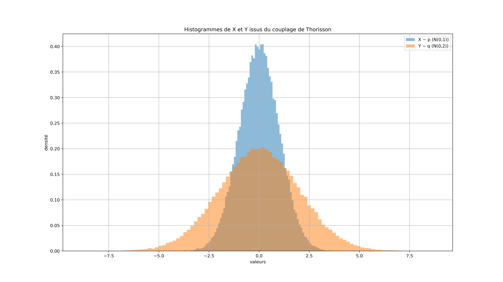

As part of a Monte Carlo Methods course at ENSAE Paris, this project implements a modified version of the **Thorisson coupling algorithm**, based on the paper *The Coupled Rejection Sampler* by Corenflos and Särkkä (2022). Given two probability distributions $p$ and $q$, a coupling is a joint distribution $\Gamma$ on $(X, Y)$ such that $X \sim p$ and $Y \sim q$. Among all such couplings, a **maximal coupling** is one that maximizes $\mathbb{P}(X = Y)$, and a classical result shows that this maximum equals $1 - \|p - q\|_{TV}$, or equivalently $\int \min(p(x), q(x)) \, dx$. The algorithm constructs such a coupling via an acceptance-rejection scheme, with a tunable parameter $C$ that controls the trade-off between the coupling probability and the variance of the execution time.






### The Thorisson Coupling Algorithm

The algorithm proceeds as follows. First, sample $X \sim p$ and $U \sim \mathcal{U}(0,1)$. If

$$U < \min\!\left(\frac{q(X)}{p(X)},\, C\right),$$

then set $Y = X$ — the two variables have met. Otherwise, sample from the residual of $q$ not dominated by $C \cdot p$: draw $Z \sim q$ and $U \sim \mathcal{U}(0,1)$ repeatedly until

$$U > \min\!\left(1,\, \frac{C \cdot p(Z)}{q(Z)}\right),$$

then set $Y = Z$. The resulting pair $(X, Y)$ satisfies $X \sim p$, $Y \sim q$, and $\mathbb{P}(X = Y) = \int \min(C \cdot p(x), q(x))\,dx$.

The parameter $C \in (0, 1]$ introduces a deliberate suboptimality: by setting $C < 1$, the coupling probability decreases, but the variance of the algorithm's run time is kept finite even as $p$ and $q$ approach each other — a property the standard maximal coupling ($C = 1$) does not enjoy.

<details>
<summary>Show the implementation</summary>

```python
import time
import numpy as np
import matplotlib.pyplot as plt

def thorisson_coupling(p_densite, p_echantillon, q_densite, q_echantillon, C=1.0):
    X = p_echantillon()
    U = np.random.uniform()

    if U < min(q_densite(X) / p_densite(X), C):
        Y = X
    else:
        A = 0
        while A != 1:
            Z = q_echantillon()
            U = np.random.uniform()
            if U > min(1, C * p_densite(Z) / q_densite(Z)):
                A = 1
            Y = Z
    return X, Y

def calcul_integral_min(p_densite, q_densite, C=1.0, limit_integrale=5, num_points=100000):
    x_vals = np.linspace(-limit_integrale, limit_integrale, num_points)
    min_vals = np.minimum(C * p_densite(x_vals), q_densite(x_vals))
    dx = x_vals[1] - x_vals[0]
    return np.sum(min_vals) * dx

def erreur_egalite(X_val, Y_val, e=0.01):
    return sum(np.abs(X_val - Y_val) <= e)
```

</details>


### Application: Coupling $\mathcal{N}(0,1)$ and $\mathcal{N}(0,2)$

To validate the implementation, we couple $p = \mathcal{N}(0,1)$ and $q = \mathcal{N}(0,2)$ over 100,000 simulations with $C = 0.99$. Three quantities are checked: the empirical coupling probability $\mathbb{P}(X \approx Y)$, compared against the theoretical value $\int \min(C \cdot p(x), q(x))\,dx$ computed numerically; and the mean and variance of the execution time, to verify that the algorithm terminates in finite expected time.

<details>
<summary>Show the simulation</summary>

```python
# Densities and samplers
def p_densite(x):      # N(0,1)
    return np.exp(-x**2 / 2) / np.sqrt(2 * np.pi)

def p_echantillon():
    return np.random.normal(0, 1)

def q_densite(x):      # N(0,2)
    return np.exp(-x**2 / 8) / (2 * np.sqrt(2 * np.pi))

def q_echantillon():
    return np.random.normal(0, 2)

# Parameter C
C = 0.99

# Generate 100,000 coupled pairs
X_vals, Y_vals, times = [], [], []
for _ in range(100000):
    debut = time.time()
    x, y = thorisson_coupling(p_densite, p_echantillon, q_densite, q_echantillon, C)
    fin = time.time()
    X_vals.append(x)
    Y_vals.append(y)
    times.append(fin - debut)

X_vals = np.array(X_vals)
Y_vals = np.array(Y_vals)
times  = np.array(times)

# Results
print(f"Empirical P(X ≈ Y)              = {erreur_egalite(X_vals, Y_vals) / len(X_vals):.3f}")
print(f"Theoretical ∫ min(C·p, q)       ≈ {calcul_integral_min(p_densite, q_densite, C=C):.3f}")
print(f"Mean execution time             = {np.mean(times):.6f} s")
print(f"Variance of execution time      = {np.var(times):.2e}")

# Plot marginals
plt.figure(figsize=(16, 9))
plt.hist(X_vals, bins=100, density=True, alpha=0.5, label='X ~ p = N(0,1)')
plt.hist(Y_vals, bins=100, density=True, alpha=0.5, label='Y ~ q = N(0,2)')
plt.legend()
plt.title("Marginal distributions of X and Y from the Thorisson coupling")
plt.xlabel("Value")
plt.ylabel("Density")
plt.grid(True)
plt.show()
```

</details>
{width=100%}

The empirical coupling probability closely matches the theoretical integral of $\min(C \cdot p, q)$, confirming the correctness of the implementation. The marginal histograms recover $\mathcal{N}(0,1)$ and $\mathcal{N}(0,2)$ respectively, and the finite variance of the execution time reflects the controlled trade-off introduced by $C < 1$.
