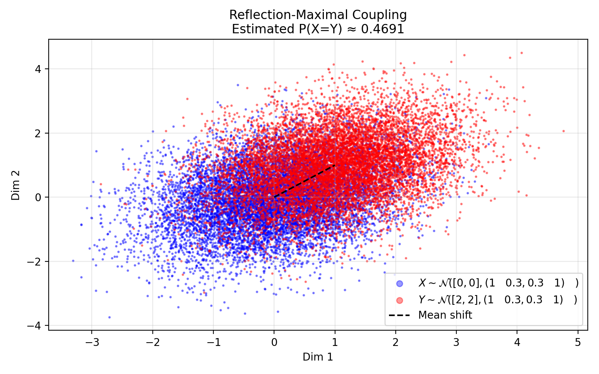
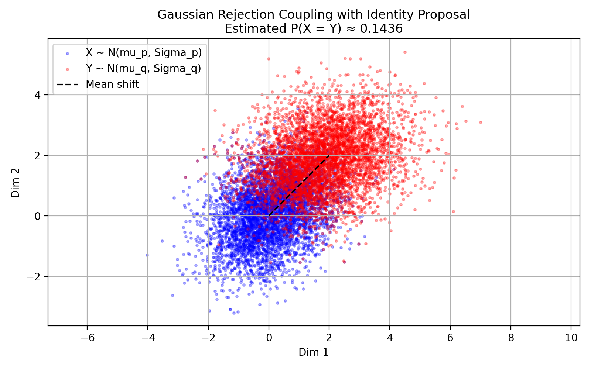

As part of a Monte Carlo Methods course at ENSAE Paris, this group project implements and tests a modified version of the **Thorisson coupling algorithm**, based on the paper *The Coupled Rejection Sampler* by Corenflos and Särkkä (2022). Given two probability distributions $p$ and $q$, a coupling is a joint distribution $\Gamma$ on $(X, Y)$ such that $X \sim p$ and $Y \sim q$. Among all such couplings, a **maximal coupling** is one that maximizes $\mathbb{P}(X = Y)$, and a classical result shows that this maximum equals $1 - \|p - q\|_{TV}$, or equivalently $\int \min(p(x), q(x)) \, dx$. The project is organized in four parts: implementation of the core algorithm, systematic testing across distribution pairs, an implementation of the coupled rejection sampler from the paper, and Gaussian-specific coupling methods.






### The Thorisson Algorithm and Core Implementation

The algorithm proceeds as follows. First, sample $X \sim p$ and $U \sim \mathcal{U}(0,1)$. If

$$U < \min\!\left(\frac{q(X)}{p(X)},\, C\right),$$

then set $Y = X$ — the two variables have met. Otherwise, sample from the residual of $q$ not dominated by $C \cdot p$: draw $Z \sim q$ and $U \sim \mathcal{U}(0,1)$ repeatedly until

$$U > \min\!\left(1,\, \frac{C \cdot p(Z)}{q(Z)}\right),$$

then set $Y = Z$. The resulting pair $(X, Y)$ satisfies $X \sim p$, $Y \sim q$, and $\mathbb{P}(X = Y) = \int \min(C \cdot p(x), q(x))\,dx$.

The parameter $C \in (0, 1]$ trades off coupling probability against execution time variance: increasing $C$ raises $\mathbb{P}(X = Y)$ but inflates the variance of the algorithm's runtime, a problem the standard maximal coupling ($C = 1$) cannot avoid when $p$ and $q$ are close.

<details>
<summary>Show the implementation</summary>

```python
import numpy as np

def thorisson_coupling(p_densite, p_echantillon, q_densite, q_echantillon, C=1.0):
    X = p_echantillon()
    U = np.random.uniform()
    if U < min(q_densite(X) / p_densite(X), C):
        Y = X
    else:
        A = 0
        while A != 1:
            Z = q_echantillon()
            U = np.random.uniform()
            if U > min(1, C * p_densite(Z) / q_densite(Z)):
                A = 1
            Y = Z
    return X, Y

def calcul_integral_min(p_densite, q_densite, C=1.0, limit=5, num_points=100000):
    x_vals = np.linspace(-limit, limit, num_points)
    return np.sum(np.minimum(C * p_densite(x_vals), q_densite(x_vals))) * (2 * limit / num_points)

def erreur_egalite(X_val, Y_val, e=0.01):
    return np.sum(np.abs(X_val - Y_val) <= e)
```

</details>

To validate the implementation, we couple $p = \mathcal{N}(0,1)$ and $q = \mathcal{N}(0,2)$ over 100,000 simulations with $C = 0.99$, and check that the empirical coupling probability matches $\int \min(C \cdot p, q)\,dx$ and that the execution time variance is finite.

<details>
<summary>Show the simulation</summary>

```python
import time

def p_densite(x): return np.exp(-x**2 / 2) / np.sqrt(2 * np.pi)
def p_echantillon(): return np.random.normal(0, 1)
def q_densite(x): return np.exp(-x**2 / 8) / (2 * np.sqrt(2 * np.pi))
def q_echantillon(): return np.random.normal(0, 2)

C = 0.99
X_vals, Y_vals, times = [], [], []
for _ in range(100000):
    t0 = time.time()
    x, y = thorisson_coupling(p_densite, p_echantillon, q_densite, q_echantillon, C)
    X_vals.append(x); Y_vals.append(y); times.append(time.time() - t0)

X_vals, Y_vals, times = map(np.array, [X_vals, Y_vals, times])
print(f"Empirical P(X ≈ Y)        = {erreur_egalite(X_vals, Y_vals) / len(X_vals):.3f}")
print(f"Theoretical ∫ min(C·p, q) ≈ {calcul_integral_min(p_densite, q_densite, C=C):.3f}")
print(f"Mean exec time            = {np.mean(times):.6f} s")
print(f"Variance of exec time     = {np.var(times):.2e}")
```

</details>

{width=100%}

The empirical coupling probability closely matches the theoretical value, the marginals recover $\mathcal{N}(0,1)$ and $\mathcal{N}(0,2)$, and the finite variance of execution time reflects the effect of setting $C < 1$.


### Systematic Testing Across Distribution Pairs

The second part of the project tests the algorithm on three distribution pairs — $\mathcal{N}(0,1)$ vs $\mathcal{N}(0,2)$, $\mathcal{U}(0,1]$ vs $\mathcal{U}[-1,1]$, and $\mathcal{N}(0,1)$ vs $\mathcal{U}[-1,1]$ — and studies the effect of $C$ on the coupling probability, mean execution time, and execution time variance. For each pair, the analysis follows a three-step protocol: choose $C$ by sweeping from 0.01 to 1, verify sample convergence via histograms, and check independence via autocorrelation.

The $\mathcal{N}(0,1)$ vs $\mathcal{U}[-1,1]$ case is the most interesting because the two densities have bounded overlap. The uniform is entirely supported on $[-1, 1]$, so $\min(p, q)$ is non-zero only on that interval, which caps the maximal coupling probability well below 1 regardless of $C$.

The sweep shows that $C = 1$ maximises the coupling probability while keeping execution time and its variance at acceptable levels. The autocorrelation of both $X$ and $Y$ samples stays within the $\pm 0.05$ band for all lags beyond 0, confirming that successive draws are effectively independent. The runtime scales linearly with sample size, as expected for an $\mathcal{O}(n)$ algorithm.


### The Coupled Rejection Sampler from the Paper

Then, we implemented Algorithm 1 from Corenflos and Särkkä directly: the **coupled rejection sampler**. Rather than treating $p$ and $q$ independently, the algorithm uses a shared proposal $\hat{\gamma}$ that jointly dominates both. Two constants $M_p$ and $M_q$ bound the density ratios $p/\hat{p}$ and $q/\hat{q}$, and a single uniform draw determines acceptance for both marginals simultaneously, maximising the chance that $X = Y$.


The high-dimensional extension replaces scalar densities with multivariate Gaussians and studies how runtime and the number of rejection attempts scale with dimension $d$. Both grow rapidly beyond $d \approx 20$, illustrating the well-known curse of dimensionality for rejection-based methods.


### Gaussian-Specific Couplings

The fourth contribution focuses on coupling methods tailored to Gaussian distributions. Two approaches are implemented. The first is the **reflection-maximal coupling**: given $p = \mathcal{N}(\mu_p, \Sigma)$ and $q = \mathcal{N}(\mu_q, \Sigma)$ with a shared covariance, $X$ is drawn from $p$ and then either $Y = \mu_q + \Sigma^{1/2}z$ (same Gaussian noise, giving $X = Y$ with probability $e^{-\frac{1}{2}\delta^\top\Sigma^{-1}\delta}$ where $\delta = \mu_q - \mu_p$) or $Y$ is drawn from the reflected residual. The second is a **Gaussian rejection coupling** for distributions with distinct covariances $\Sigma_p \neq \Sigma_q$, using an isotropic proposal scaled by the largest eigenvalue.

<details>
<summary>Show the reflection coupling</summary>

```python
import numpy as np
import matplotlib.pyplot as plt

def reflection_maximal_gaussian_coupling(mu_p, mu_q, Sigma, n_samples=10000):
    Sigma_inv  = np.linalg.inv(Sigma)
    Sigma_sqrt = np.linalg.cholesky(Sigma)
    delta      = mu_q - mu_p
    alpha      = np.exp(-0.5 * delta @ Sigma_inv @ delta)  # P(X = Y)

    samples_X, samples_Y, matches = [], [], 0
    for _ in range(n_samples):
        z = np.random.normal(0, 1, size=len(mu_p))
        x = mu_p + Sigma_sqrt @ z
        if np.random.uniform() < alpha:
            y = mu_q + Sigma_sqrt @ z   # coupled
            matches += 1
        else:
            reflect_z = z - 2 * ((z @ (Sigma_inv @ delta)) / (delta @ Sigma_inv @ delta)) * delta
            y = mu_q + Sigma_sqrt @ reflect_z
        samples_X.append(x); samples_Y.append(y)

    return np.array(samples_X), np.array(samples_Y), matches / n_samples

mu_p  = np.array([0.0, 0.0])
mu_q  = np.array([1.0, 1.0])
Sigma = np.array([[1.0, 0.3], [0.3, 1.0]])
X, Y, prob = reflection_maximal_gaussian_coupling(mu_p, mu_q, Sigma)

coupled_ref = np.array([np.allclose(X[i], Y[i], atol=1e-10) for i in range(len(X))], dtype=bool)

plt.figure(figsize=((8,8)))
label_p = r"$X \sim \mathcal{N}([0,0], (1 \quad 0.3, 0.3 \quad 1) \quad)$"
label_q = r"$Y \sim \mathcal{N}([2,2], (1 \quad 0.3, 0.3 \quad 1) \quad)$"
plt.scatter(X[~coupled_ref, 0], X[~coupled_ref, 1], s=2, alpha=0.4, color="blue", label=label_p)
plt.scatter(Y[~coupled_ref, 0], Y[~coupled_ref, 1], s=2, alpha=0.4, color="red" , label=label_q)
plt.plot([mu_p[0], mu_q[0]], [mu_p[1], mu_q[1]], "k--", linewidth=1.5, label="Mean shift")
plt.title(f"Reflection-Maximal Coupling\nEstimated P(X=Y) ≈ {prob:.4f}")
plt.xlabel("Dim 1"); plt.ylabel("Dim 2"); plt.legend(markerscale=4); plt.grid(True, alpha=0.3)
plt.tight_layout(); plt.savefig("reflection_coupling.png", dpi=200); plt.show()
```

</details>
{width=100%}

For the unequal-covariance case, the proposal is $\hat{p} = \mathcal{N}(\mu_p, \lambda_{\max} I)$ where $\lambda_{\max}$ is the largest eigenvalue across both covariances, and the coupling constants are $M_p = \sqrt{|\Sigma_{\max}|/|\Sigma_p|}$, $M_q = \sqrt{|\Sigma_{\max}|/|\Sigma_q|}$. A single uniform draw then jointly accepts or rejects a proposal for both marginals, maximising the probability of $X = Y$ without the distributional restrictions of the reflection approach.

<details>
<summary>Show the Gaussian rejection coupling</summary>

```python
import numpy as np
import matplotlib.pyplot as plt
from scipy.stats import multivariate_normal
from numpy.linalg import inv, eigvals, det

mu_p = np.array([0.0, 0.0])
mu_q = np.array([2.0, 2.0])

Sigma_p = np.array([[1.0, 0.3], [0.3, 1.0]])
Sigma_q = np.array([[1.5, 0.2], [0.2, 1.0]])

lambda_max = max(np.max(np.linalg.eigvals(Sigma_p)), np.max(np.linalg.eigvals(Sigma_q))) # As evoked in the article I take \Sigma_max that way.
Sigma_hat = lambda_max * np.eye(2)

proposal_mean = mu_p

# Compute M_p and M_q from determinant ratios, formula of the article
M_p = np.sqrt(det(Sigma_hat) / det(Sigma_p))
M_q = np.sqrt(det(Sigma_hat) / det(Sigma_q))

# Gaussian distributions
mv_p = multivariate_normal(mean=mu_p, cov=Sigma_p) # The ones we want to couple
mv_q = multivariate_normal(mean=mu_q, cov=Sigma_q)
mv_hat = multivariate_normal(mean=proposal_mean, cov=Sigma_hat) # Proposal

def gaussian_rejection_coupling():
    while True:
        z = mv_hat.rvs()
        u = np.random.uniform()

        w_p = mv_p.pdf(z) / mv_hat.pdf(z)
        w_q = mv_q.pdf(z) / mv_hat.pdf(z)

        if u < min(w_p / M_p, w_q / M_q):
            return z, z  # Coupled sample
        else:
            x = mv_p.rvs()
            y = mv_q.rvs()
            return x, y  # Independent fallback

n_samples = 5000
samples_X, samples_Y, coupled = [], [], 0

for _ in range(n_samples):
    x, y = gaussian_rejection_coupling()
    samples_X.append(x)
    samples_Y.append(y)
    if np.allclose(x, y, atol=1e-6):
        coupled += 1

samples_X, samples_Y = np.array(samples_X), np.array(samples_Y)

plt.figure(figsize=(8, 5))
plt.scatter(samples_X[:, 0], samples_X[:, 1], alpha=0.3, label='X ~ N(mu_p, Sigma_p)', color='blue', s=5)
plt.scatter(samples_Y[:, 0], samples_Y[:, 1], alpha=0.3, label='Y ~ N(mu_q, Sigma_q)',  color='red', s=5)
plt.plot([mu_p[0], mu_q[0]], [mu_p[1], mu_q[1]], 'k--', label='Mean shift')
plt.title(f"Gaussian Rejection Coupling with Identity Proposal\nEstimated P(X = Y) ≈ {coupled / n_samples:.4f}")
plt.xlabel("Dim 1"); plt.ylabel("Dim 2"); plt.legend()
plt.axis("equal"); plt.grid(True); plt.tight_layout(); plt.savefig('gaussian_rejection_coupling.png', dpi=200); plt.show()
```

</details>

{width=100%}
