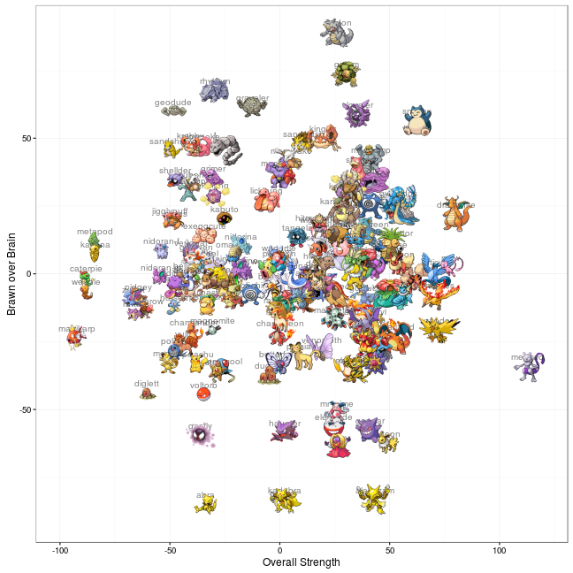
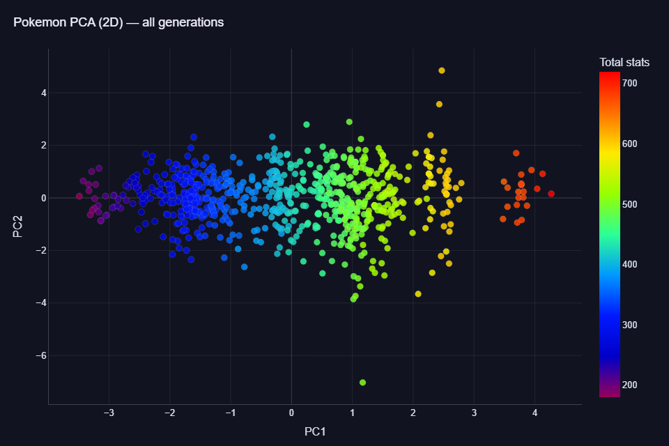
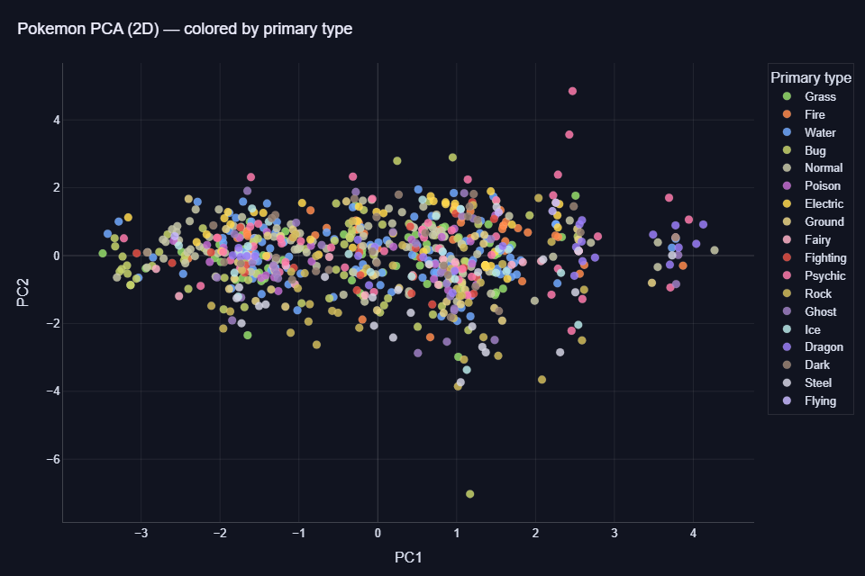
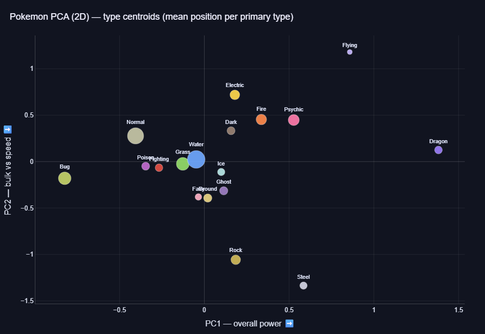
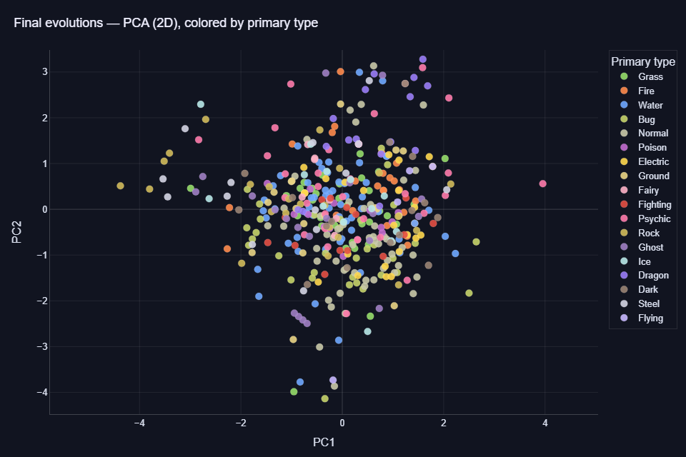
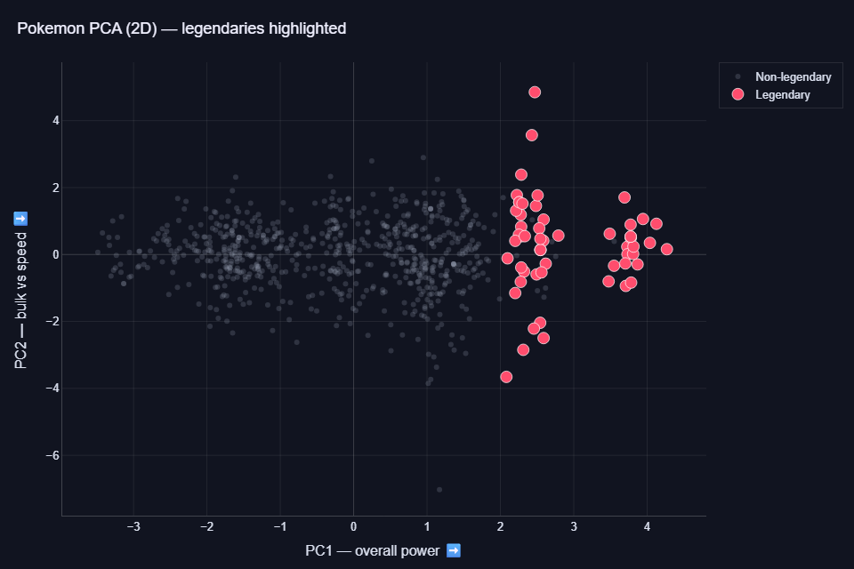
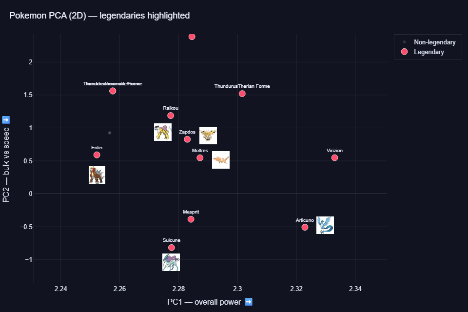

{width=1pt}

In this project, I apply a `Principal Component Analysis (PCA)` to the six battle statistics of Pokemon — `HP, Attack, Defense, Special Attack, Special Defense and Speed` — and explore how the full Pokédex sits in the resulting 2D spaces. The analysis covers all `six generations` of the CSV (~721 species), with a specific pass on the subset of `final evolutions` and a final view with `legendaries` highlighted against the rest.

Going from 6 dimensions to 2 is a modest reduction, so this project is really about `exploring structure` rather than dramatic compression. The interpretation comes from reading the `loadings` of each principal component and pairing the scatter with a `biplot`.

### The dataset

The stats come from the well-known `Pokemon with stats` dataset originally published on Kaggle by Alberto Barradas and mirrored as a stable raw CSV on GitHub Gist. The CSV covers Generations 1 through 6, one row per species (plus Mega / Primal forme rows which we drop upstream). Download it directly here: <a href="https://gist.githubusercontent.com/armgilles/194bcff35001e7eb53a2a8b441e8b2c6/raw/92200bc0a673d5ce2110aaad4544ed6c4010f687/pokemon.csv" target="_blank">pokemon.csv</a>. 

The CSV does not flag `final evolutions`, so I hand-curated the complement: a `NON_FINALS` set of every species that has a further evolution within Gen 1-6. Any Pokemon not in that set is treated as a final evolution. Cross-generational evolutions demote the earlier forms (`Onix` is non-final because of `Steelix`, `Magneton` because of `Magnezone`, and so on). 

### The PCA pipeline

The six stats share a nominal 1-255 scale but their empirical variances differ, so each stat is `standardized` (zero mean, unit variance) before the PCA is fit. The interpretation of the first three components (even though we only keep two) is: 

* `PC1` — sum of loadings is positive, so `higher PC1 means more overall power`.
* `PC2` — HP + Sp. Def loading sums negative, so `lower PC2 means bulkier / more defensive`.
* `PC3` — Attack loading is positive, so `higher PC3 means leans physical (vs special)`.

On the 721 Pokemon in the CSV, the first two components typically capture around `62 %` of the total variance, with PC1 dominated by offensive and defensive stats *together* (the "size of the Pokemon"), PC2 contrasting bulk against speed. If we add the third we get 73% of total variance and PC3 is picking up physical-vs-special.

### Baseline view: every Pokemon, Total-colored

A first plain scatter of all Pokemon on PC1-PC2. Points are colored by their `Total stat` as a sanity check — since PC1 is the overall-power axis, the color gradient should line up neatly along PC1.

{width=100%}

### colored by primary type

Same points, now colored by the Pokemon's `primary type (Type 1)`. Dual-type Pokemon are still shown under their primary type only — the secondary type appears on hover.

Honest expectation: types are gameplay categories, not stat-determining labels, so heavy overlap is normal. The chart is useful for spotting which types skew along PC1 or PC2 (e.g. Steel and Rock sit high on defensive stats; Flying leans offensive-fast) rather than for finding clean clusters.

{width=100%}
{width=100%}

### Final evolutions only

Next I restrict to every final evolution across Gen 1-6 and `re-fit` the PCA on that subset. This matters: the principal axes depend on the covariance of the data they are fit on. If I only projected final evolutions using the axes learned from the full population, I would still be looking at directions that separate all Pokemon.

{width=100%}

### Legendaries highlighted

Finally, the full population again — non-legendaries drawn dim so they act as context, legendaries in the accent color, enlarged and labeled. PC1 tracks total stats by construction, so legendaries cluster on the high-PC1 side (that is the sanity check, not the finding). The interesting structure is PC2 and PC3: the `Articuno-Zapdos-Moltres` triad split along the bulk-vs-speed axis with a slight increase of overall power for the bulkiest. Creatures like `Raikou` or `Suicune` trade offense for extreme bulk; interestingly, the last one from the trio (`Entei`) has a smaller overall power and sits in the middle for the bulk-vs-speed.

{width=100%}
{width=100%}
### Trying it yourself

To run the full pipeline in one place, download the jupyter notebook here: <a href="_pokemon_pca_notebook.ipynb" download="pokemon_pca_notebook.ipynb">pokemon_pca_notebook.ipynb</a>. The only requirements are `pandas`, `scikit-learn` and `plotly`.
