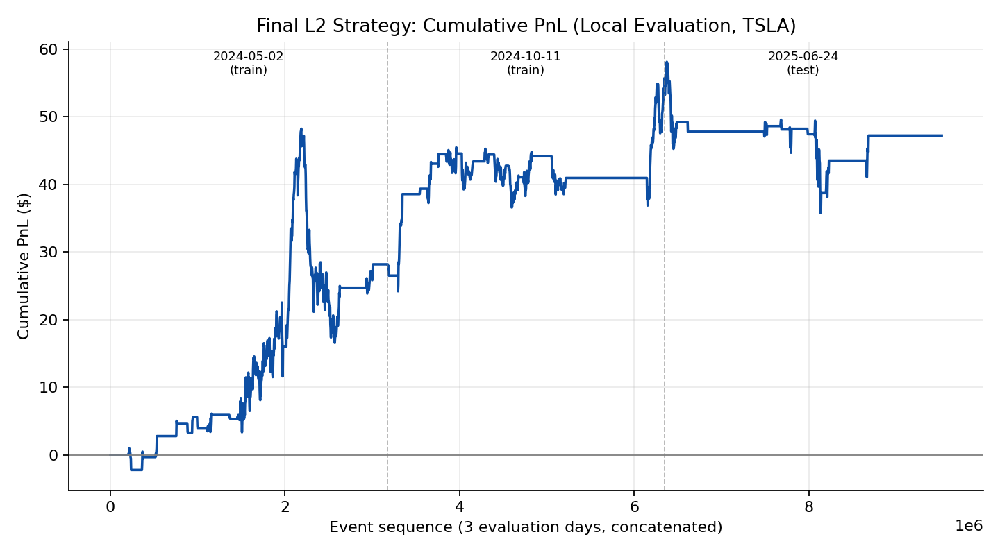
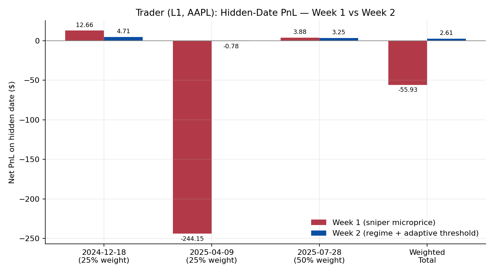
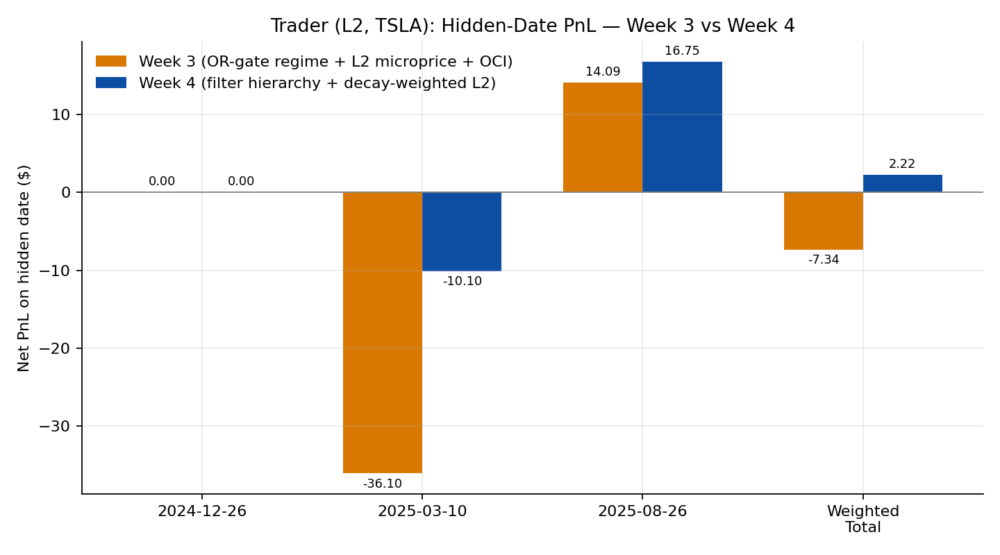

{width=1pt}

This page documents the four-week trading-strategy sequence from **MGMTMFE 412: Trading, Market Frictions, and FinTech** at UCLA Anderson, run against a course autograder that replays real Databento order-book data (`AAPL` at L1 for weeks 1-2, `TSLA` at L2 for weeks 3-4) and scores submissions on three *hidden* out-of-sample dates each week. Every week's code was written and revised together with **Claude (Anthropic)**: I provided the assignment brief, the previous week's code, and the instructor's feedback, and Claude proposed the signal logic, implemented it, and helped debug it against the local simulator before submission. All numbers below — PnL, drawdowns, scores — are taken directly from the autograder's `summary.json` files and the instructor's feedback reports; nothing here is re-simulated for the writeup.

### Weeks 1-2: an L1 sniper on AAPL, then a regime-aware rewrite

The week-1 strategy is a high-conviction *sniper*: it trades only when the volume-weighted micro-price diverges from the mid-price by more than a threshold equivalent to a 90% order-book imbalance, and only when the spread is already at its minimum tick. The signal has a clean closed form, $\text{signal} = \frac{S}{2}\rho$, where $S$ is the spread and $\rho$ is the size-imbalance ratio — a relationship the instructor's feedback specifically praised as "genuinely impressive... you didn't just use a formula, you understood and explained its economic content." Tight inventory caps and sparse sampling kept violations at zero on all three hidden dates, but the strategy itself proved fragile: on 2025-04-09 it lost \$244.15 with a -\$336.24 drawdown (score -328.21), dragging the weighted hidden-date score to -80.31 even though the other two dates were fine.

Week 2 was a near-complete rewrite (11% code similarity to week 1) built around two ideas: a session-level *regime classifier* that adapts the entry threshold to the prevailing volatility/trend regime, and tighter, adaptive thresholds that no longer fire on the kind of move that produced the 2025-04-09 blow-up. The effect on the hidden dates was dramatic:

| Hidden date (weight) | Week 1 PnL | Week 2 PnL | Δ PnL |
|---|---|---|---|
| 2024-12-18 (25%) | \$12.66 | \$4.71 | -\$7.95 |
| 2025-04-09 (25%) | -\$244.15 | -\$0.78 | +\$243.37 |
| 2025-07-28 (50%) | \$3.88 | \$3.25 | -\$0.63 |
| **Weighted total** | **-\$55.93** | **\$2.61** | **+\$58.54** |

{width=100%}

The hidden weighted score moved from -80.31 to -0.13 — essentially flat — while the Risk Score rose from 67.2/100 to 70.1/100 and the Innovation score from 90/100 to 93/100, and the instructor's review labeled the change a "CLEAR" improvement. The fix worked precisely where it needed to: it gave up a little PnL on the two calm dates (-\$7.95 and -\$0.63) in exchange for almost entirely closing out a -\$244 tail event. The remaining gap flagged in the feedback is structural rather than parametric: the regime classifier and the trading logic still don't share a single position-state object — a latent gross-exposure risk if both modules ever tried to act independently — and the regime is classified once at session open rather than re-evaluated intraday.

### Weeks 3-4: extending to L2 depth-of-book on TSLA

Weeks 3-4 moved to `TSLA` with full L2 (10-level) order-book access. Porting the week-1/2 AAPL logic directly to TSLA — different tick size, different volatility profile — produced only -\$18.85 PnL across 11 orders, confirming that the L1 layer needed re-calibration before any L2 signal could help. Re-tuning the L1 parameters for TSLA (`MOM_THRESHOLD_BPS` 10 → 20, `BB_N_STD` 2.0 → 2.5, `MAX_SPREAD` widened from \$0.01 to \$0.02-0.03, `SIGNAL_THRESHOLD` 0.0045 → 0.0135) produced an L1-only TSLA baseline of \$20.30 PnL, -\$5.46 max drawdown, and 44 fills — the reference point for everything that follows.

The week-3 submission added two more modules on top of that recalibrated L1 base: a depth-weighted L2 microprice (aggregating cross-weighted price/size across the top 5 levels, with a dynamic threshold of $\max(1.5\,\sigma_{\text{roll}},\ 0.0135)$), and an order-count-imbalance (OCI) filter that suppresses the size-based signal whenever order *counts* across the book disagree with order *sizes* — a spoofing-resistant check the instructor's review called "a nuanced design choice that reflects genuine understanding of what count vs. size each measure." On the training dates this scored 97.7/100, but the hidden dates told a different story: weighted PnL of -\$7.34 and score -11.62, with **one hidden date (2024-12-26) producing zero orders at all** and another (2025-03-10) losing \$36.10 — a textbook sign of overfitting to the training dates.

Week 4 kept the three-module architecture but fixed the position-management gap directly: a single `run_combined_strategy()` owns the *only* position variable in the system, and consumes `get_regime_signals()`, `get_l2_microprice_signals()`, and `get_order_count_signals()` via `.asof()` joins rather than letting each module manage its own state. The combined decision logic became a small truth table — if the L1 regime signal and the L2 microprice signal agree, enter or hold; if one is neutral, enter on the other; if they actively *contradict*, veto the trade or flatten the position — backed by an exit hierarchy of stop-loss (30 bps) → Bollinger-band mean-reversion exit → contradiction exit → partial unwind. Risk limits were `MAX_POSITION=50`, `ORDER_QTY=10`, `MAX_SPREAD=\$0.03`, `MAX_ORDERS=100`.

| Hidden date | Week 3 PnL | Week 4 PnL | Δ PnL |
|---|---|---|---|
| 2024-12-26 | \$0.00 | \$0.00 | +0.00 |
| 2025-03-10 | -\$36.10 | -\$10.10 | +26.00 |
| 2025-08-26 | \$14.09 | \$16.75 | +2.66 |
| **Weighted total** | **-\$7.34** | **\$2.22** | **+9.56** |

{width=100%}

The hidden weighted score improved from -11.62 to +0.46. Code similarity to week 3 was 62.6% — a substantial but not wholesale rewrite — and the Innovation score rose to 92/100, again flagged as a "CLEAR" improvement. On the current in-repo evaluation (three local dates: 2024-05-02, 2024-10-11, and a 2025-06-24 test date), the final combined strategy produces \$47.20 net PnL, -\$32.30 max drawdown, 0 violations, and 121 fills across 120 orders, for a local score of 29.03 — versus \$20.30 PnL / -\$5.46 drawdown / 44 fills for the L1-only TSLA baseline on the same dates.

{width=100%}

### Limits

Three issues are worth being honest about. First, **2024-12-26 still produces zero orders in both week 3 and week 4** — the combined filter hierarchy (regime + L2 microprice + OCI, all required to align before a trade fires) is apparently never satisfied under that date's conditions, and neither iteration diagnosed why. Second, the L2 overlay's PnL gain comes with a real risk cost: max drawdown roughly *sextupled* (-\$5.46 → -\$32.30) while PnL grew by only about 130% locally — more signals firing means more trades, higher turnover (\$280k), and a noticeably rockier equity curve, which the cumulative-PnL chart above shows clearly in the choppier test-date segment (2025-06-24). Third, the hidden-date weighted score of +0.46 is barely above zero — a genuine improvement over -11.62, but still close to "ties a flat position" rather than a demonstrated edge. The regime classifier in both the L1 and L2 strategies is still computed once at session open rather than updated intraday, a gap the instructor flagged after week 2 that neither week 3 nor week 4 addressed; re-evaluating the regime on a rolling window so the filter hierarchy can react to intraday regime shifts — not just the opening one — would be the natural next iteration.
