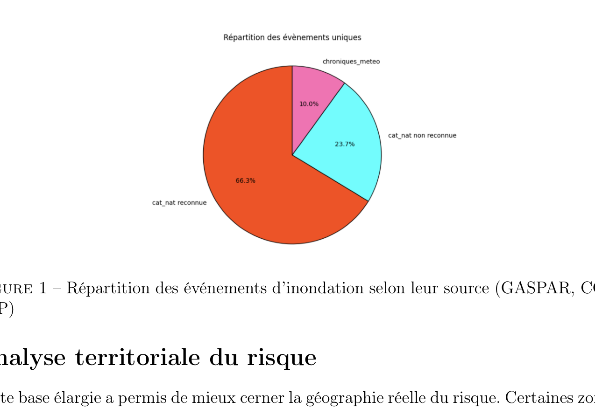
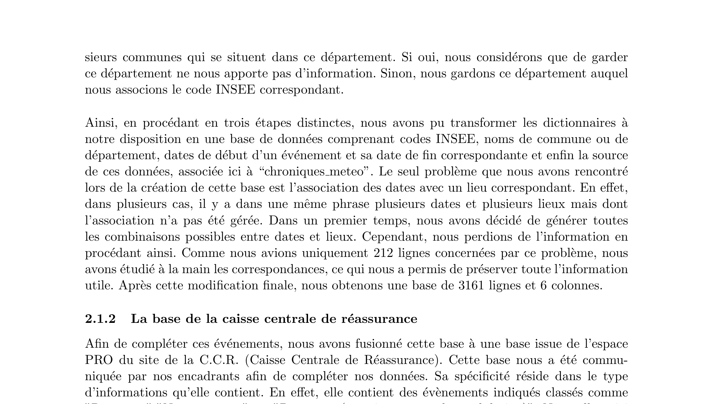
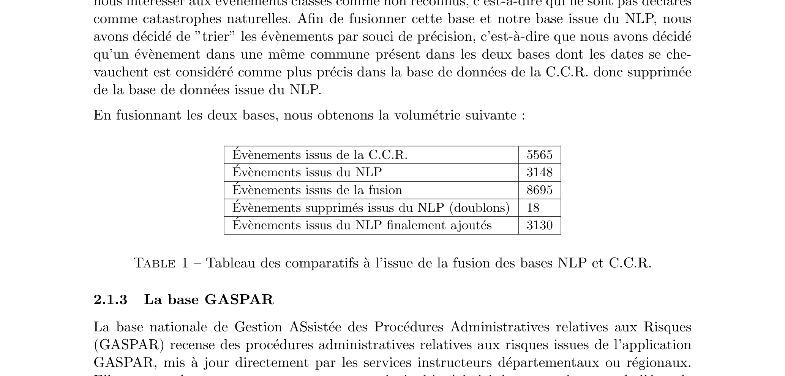
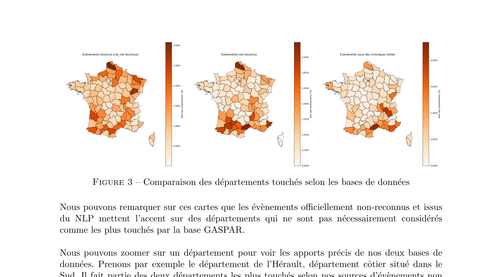
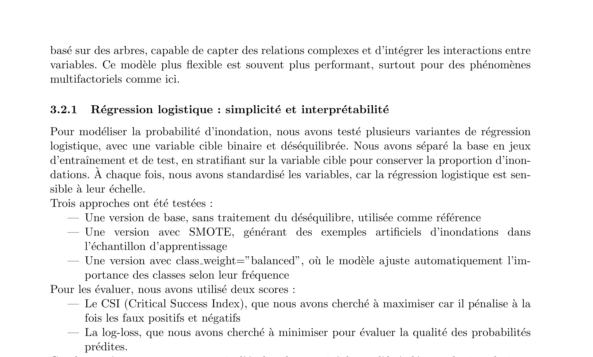
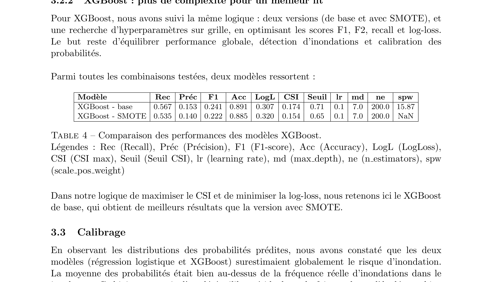
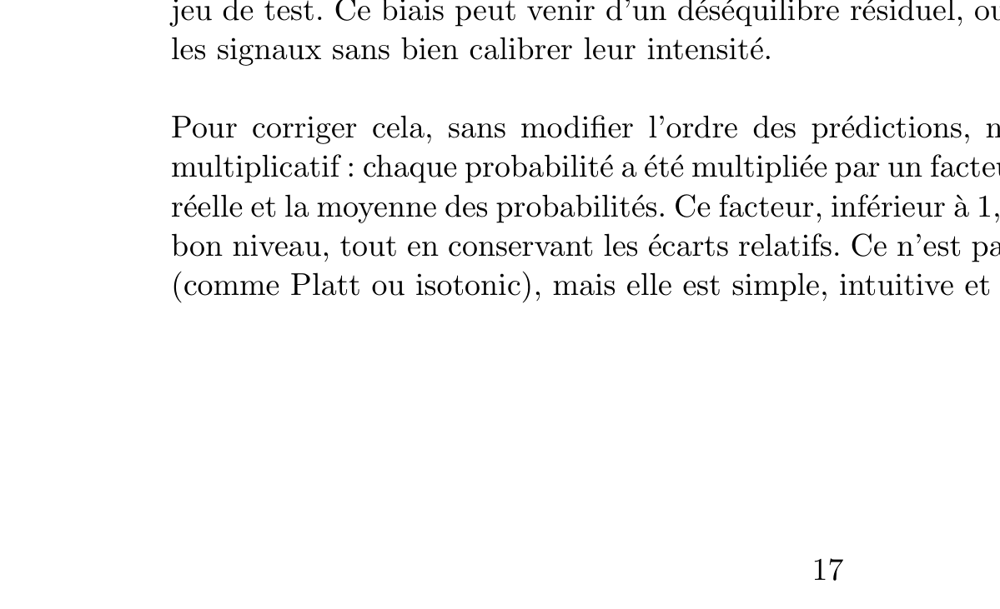
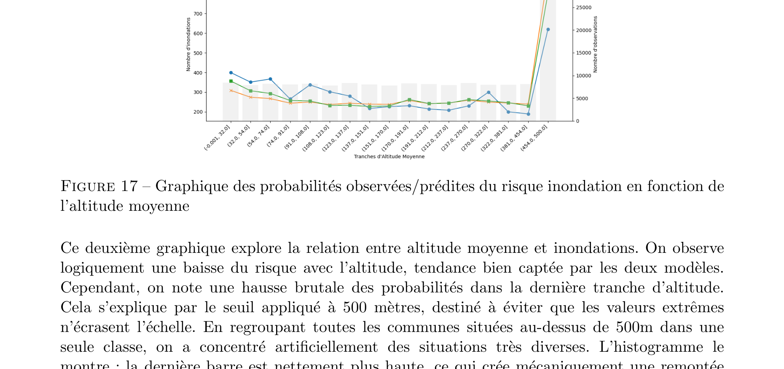
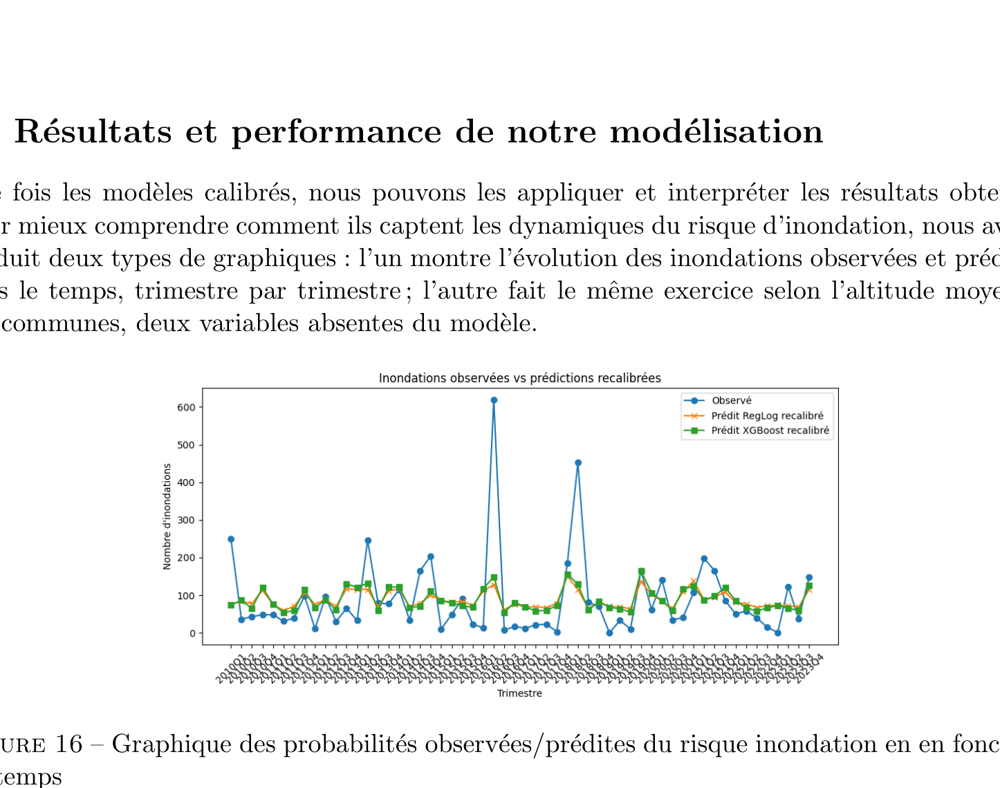
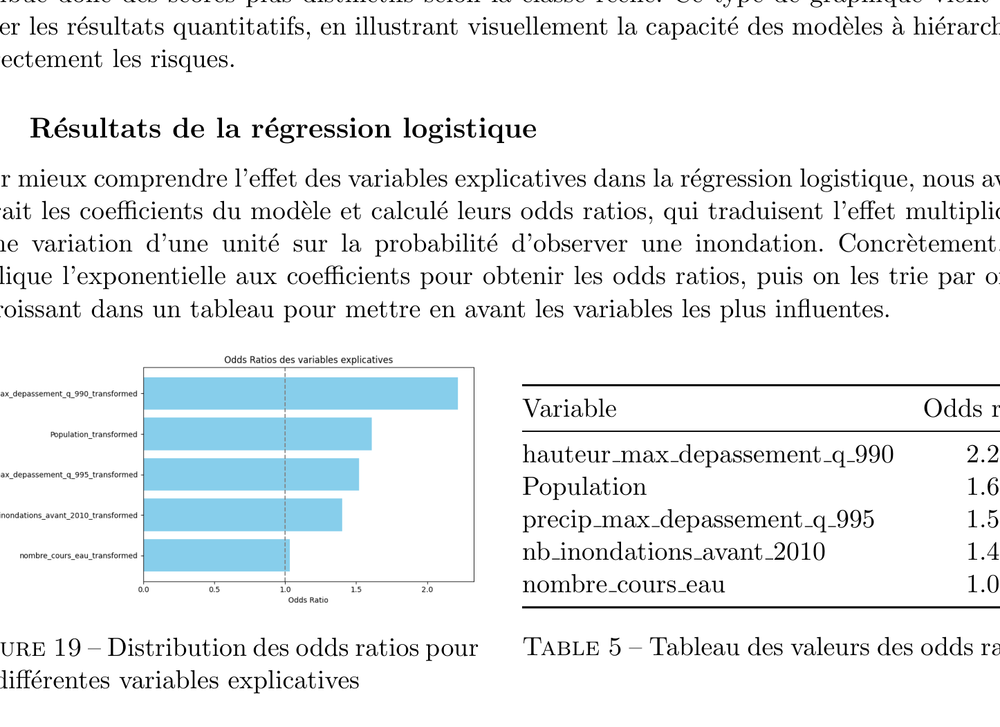

This page presents a project carried out as part of the **Statistiques Appliquées (Statapp)** course at ENSAE Paris, in partnership with **Addactis France** (supervised by Margaux Regnault and Mulah Moriah, and academically by Prof. Thierry Kamionka). The goal was to improve the measurement of flood risk in France by detecting floods that never made it into the official statistics — and then to model the risk at the level of individual municipalities.

---

### The Problem: Many Floods Are Never Officially Counted

In France, the main database for natural disasters is called **GASPAR** (Base nationale de Gestion ASsistée des Procédures Administratives relatives aux Risques). It records events that have been officially recognized as *catastrophes naturelles* by the French state. The problem is how that recognition works: after a flood, residents must report damages to their insurer and to the municipality. The mayor then has 18 months to request a formal declaration from the prefect, who forwards it to the Ministry of the Interior. The minister can approve, reject, or delay the request. Only approved events make it into GASPAR.

This administrative chain has an obvious consequence: floods that are real but localized, where residents don't claim, or where the political will to file is absent, are simply missing from the data. From a statistical perspective, the database is **right-biased toward severe and well-documented events**. Any risk model trained on it will underestimate frequency and mischaracterize the spatial distribution of flood risk.

Our project tried to fix this by building an enriched database that captures as many of those missing events as possible.

---

### Step 1 — Mining Text with NLP: the Météo-Paris Chronicles

The first source of additional data was the website **Météo-Paris**, which has published detailed weather chronicles since the 19th century. These texts describe meteorological events for each period, often mentioning floods by location and date. We processed two dictionaries of these texts: one organized by quarter-year (from 1850 to Q3 2024) and one by article title (covering 2014–2025).

The NLP pipeline worked in three stages. First, we **cleaned the raw text**: removed recurring boilerplate phrases, cut off page footers, and standardized formatting. Second, we **extracted all dates** from each text using both pattern matching (e.g., "du 3 au 7 janvier") and a specialized medical NLP module (EDS-NLP, developed by AP-HP) repurposed for date detection. Third, we **classified paragraphs** as flood-related or not. For this, we used the SentenceTransformer model `paraphrase-MiniLM-L6-v2` to convert each paragraph into a vector embedding, then trained a logistic classifier on a selection of manually labeled years. We further filtered results using keyword patterns ("submerger", "crue", "déborder" for floods; "déluge", "inondation" for confirmation). Finally, we **located the events** using spaCy's named-entity recognition to detect place names (GPE and LOC entities), which we matched against an official INSEE database of French communes.

After cleaning and deduplication, this NLP pipeline produced **3,148 flood events** that were not in GASPAR.

### Step 2 — A Second Alternative Source: the CCR Database

The second source came from the **Caisse Centrale de Réassurance (CCR)**, which provided a database of claims that were submitted but not officially recognized as natural disasters. This database contained **5,565 unrecognized events**. We merged it with the NLP output, removing overlapping events (defined as the same commune with overlapping time windows), which left us **8,039 new events** not present in GASPAR.

Merging these with GASPAR's 146,628 events gave a **final enriched database of 154,667 events** — about 5.5% more data than GASPAR alone. The pie chart below shows the breakdown.

{width=70% fig-align="center"}

The three sources have quite different geographic footprints. The maps below compare which departments are most affected under each source — and they do not always agree.

{width=100%}

A striking example is the **Hérault** department in the south of France, which is prone to *épisodes cévenols* (intense Mediterranean rainfall events). The officially recognized data understates its risk, while both the CCR and NLP sources rank it among the most flood-affected departments in France.

{width=100%}

---

### Step 3 — Clustering Departments by Flood Exposure

Once the enriched database was assembled, we computed two summary statistics per department: the **weighted flood frequency** (number of events divided by number of communes) and the **average flood duration** in days. These two variables were standardized and used as inputs to a **K-Means clustering** algorithm.

We tested cluster counts from $k=2$ to $k=19$ using three classic validation scores: the elbow method (WCSS), the silhouette score, and the Davies-Bouldin score. We settled on **$k=5$ clusters** as the best trade-off between within-cluster compactness and between-cluster separation.

The five clusters capture departments with similar historical flood profiles. We then compared our clustering to the **official risk zones** from GASPAR's AZI (Arrêtés de Zones d'Information sur les risques) records. The comparison is informative: some departments we classify as high-exposure match the official high-risk zones, validating the approach. But others that appear in our high-exposure clusters are not flagged by official zonage — potential evidence of under-reporting in the administrative system.

{width=100%}

---

### Step 4 — Building the Predictive Features

The objective of the modeling part was to predict, for each commune and each quarter, whether a flood occurred. The target variable is binary: 1 if the enriched database records an event for that commune–quarter pair, 0 otherwise.

We enriched the data with four types of explanatory variables:

**River water height.** From HydroPortail, we obtained water level measurements from **3,209 hydrometric stations** across France, covering 2010–2023 (over 11.5 million data points). For each commune, we identified the **5 nearest stations** and computed, per quarter, the maximum number of days where the station's water level exceeded various quantile thresholds (Q90, Q95, Q99, Q99.5, Q99.9). This gives a signal of extreme river conditions upstream or nearby.

**Precipitation.** Similarly, from daily precipitation data available since 1950 for all pluviometric stations in France, we assigned each commune its 5 nearest stations and counted quarterly exceedances of rainfall thresholds (Q90, Q95, Q99, Q99.5, Q99.9), measuring both the sum and the maximum across the 5 stations.

**Altitude, population, area.** Communes at low altitude, with larger populations, and with smaller surface areas tend to flood more. These structural variables were gathered from an open data repository and matched by INSEE code.

**River network.** We used a GIS database of 142,410 watercourses in France to compute, for each commune, the **number of distinct rivers crossing it** and their **total length** inside the commune's boundaries. More rivers crossing a commune means higher hydrological pressure.

**Historical flood count.** For communes with hydrometric data starting in 2010, we would lose all pre-2010 flood history. We therefore created a variable `nb_inondations_avant_2010` counting the number of recognized floods per commune before 2010. This acts as a long-run exposure proxy.

After analyzing correlation matrices to remove redundant variables (the precipitation and water-level threshold series are heavily correlated with each other), the final set of predictors selected for modeling was:

- `hauteur_max_depassement_q990` — max days above the Q99 water-height threshold across nearest stations
- `precip_max_depassement_q995` — max days above the Q99.5 precipitation threshold
- `nb_inondations_avant_2010` — historical flood count before 2010
- `nombre_cours_eau` — number of rivers crossing the commune
- `Population` — municipal population (capped at 500,000)

---

### Step 5 — Two Models: Logistic Regression and XGBoost

The dataset is highly **imbalanced**: floods are rare events, so the vast majority of commune–quarter observations are non-flood periods (class 0). We trained on a stratified train/test split and evaluated primarily on two metrics: the **CSI** (Critical Success Index, which penalizes both false positives and false negatives) and the **log-loss** (which measures calibration quality of predicted probabilities).

#### Logistic Regression

Logistic regression models the log-odds of a flood as a linear combination of the predictors. All variables were standardized before fitting (logistic regression is scale-sensitive). We tested three variants:

- **Baseline** — no handling of class imbalance
- **SMOTE** — synthetic minority oversampling to generate artificial flood examples in the training set
- **`class_weight="balanced"`** — the loss function is reweighted by inverse class frequency

The baseline and class-weight variants produced very low predicted probabilities (often between 0 and 0.1), making class discrimination essentially impossible in practice. The **SMOTE version** produced much better-spread probability distributions, with flood events assigned meaningfully higher scores than non-flood periods. Despite a modest precision of 9%, it achieved a recall of 67% — meaning it correctly flags the majority of actual floods, which is the priority in a risk detection context. We retained this version for all subsequent analyses.

#### XGBoost

XGBoost is a gradient-boosted decision tree ensemble. Each tree corrects the residual errors of the previous one, and the ensemble can capture **non-linear interactions** between variables that logistic regression cannot. We again tested a baseline and a SMOTE variant, optimizing over F1, F2, recall, and log-loss via grid search. The baseline XGBoost achieved an F1-score of **24%** (versus 16% for logistic SMOTE), with a CSI of 0.174 and a recall of 57%. Its probability distributions are better separated between the two classes.

#### Calibration

Both models were found to systematically overestimate the probability of flooding: the mean predicted probability was higher than the actual flood rate in the test set. This is a known issue when using SMOTE or when the training set artificially overrepresents the minority class. We applied a simple **multiplicative recalibration**: each predicted probability was multiplied by the ratio of the actual flood frequency to the mean predicted probability. This brings the average score back to the correct level without changing the ordering of predictions.

---

### Results

**Time series comparison.** The graph below shows the number of observed floods per quarter (blue), alongside the recalibrated predictions of the logistic model (orange) and XGBoost (green). Both models track the temporal dynamics well — they pick up the major flood surges and quiet periods. The two prediction curves are very similar and often overlapping, which suggests that the relevant signal is being captured by both approaches. The main limitation is on the peaks: the two major spikes (around 600 events) are underestimated by both models, which is expected given the rarity of those extreme quarters in the training data.

{width=100%}

**Class separation.** A key test of a risk model is whether it assigns higher scores to events that truly are floods. The density plot below shows the distribution of recalibrated probabilities separately for flood (class 1) and non-flood (class 0) observations, for both models. All four distributions are shifted: flood observations receive systematically higher probabilities. The separation is more pronounced for **XGBoost** — its flood and non-flood distributions are less overlapping — confirming its stronger discriminative power.

{width=100%}

**Logistic regression: odds ratios.** In a logistic model, the effect of each variable can be summarized by its **odds ratio** — the multiplicative change in the odds of flooding for a one-unit increase in the variable (on the standardized scale). The most influential variable is river water height above Q99 (odds ratio ≈ 2.22): a commune where nearby rivers exceeded their 99th percentile water level has more than twice the odds of flooding compared to a commune where they did not. Population also matters (OR ≈ 1.61), as do extreme precipitation (OR ≈ 1.52) and historical flood history (OR ≈ 1.40). The number of rivers crossing the commune has a smaller but positive effect (OR ≈ 1.03).

{width=55% fig-align="center"}

**XGBoost: SHAP values.** For XGBoost, we used **SHAP (SHapley Additive exPlanations)** values to understand the contribution of each variable to each prediction. The beeswarm plot below shows, for each observation, the SHAP value of each variable (horizontal position = contribution to the prediction; color = value of the variable, red = high). High water-height exceedances (red dots pushed right) strongly increase the predicted risk, while low values (blue dots) push it down. Population and historical flood count have similar patterns. Crucially, the effect of a variable is **not constant** — it depends on the values of the other variables, which is exactly what XGBoost can model and logistic regression cannot.

{width=100%}

---

### Spatial Predictions: Mapping Flood Risk at Municipality Level

The two models produce, for each commune and each quarter, an estimated probability of flooding. By averaging across time, we can produce a static risk map for the whole country.

The **logistic regression map** (below left) shows a coherent spatial pattern: the south-east stands out as the highest-risk region, consistent with the prevalence of Mediterranean extreme rainfall events. Some pockets of risk appear in the centre and north, reflecting river systems and urban density.

{width=70% fig-align="center"}

The **XGBoost map** (below) picks up more spatial heterogeneity. It identifies additional high-risk zones in the south-west and the north that the logistic model smooth over, thanks to its ability to capture local interactions between variables. This finer-grained geography makes the XGBoost map more useful for targeted prevention or premium-setting at the commune level.

{width=70% fig-align="center"}

---

### Conclusion

This project demonstrates that it is possible to significantly improve the measurement of flood risk in France by combining three complementary approaches: **NLP extraction** from weather chronicles, **administrative non-recognition data** from the CCR, and **quantitative hydroclimatic features** derived from river height and precipitation records. The enriched database adds about 8,000 events to GASPAR — modest in relative terms but potentially decisive for the communes that are systematically missed by the official system.

On the modelling side, the comparison between logistic regression and XGBoost illustrates a classic trade-off: logistic regression offers interpretability through its odds ratios and coefficients, but its linearity limits what it can capture. XGBoost is more flexible, achieves a better F1-score (24% vs 16%), and produces richer spatial predictions via SHAP values. Neither model is perfect — the recall of 57–67% means that roughly a third of actual floods are missed — but both are well-calibrated and provide a meaningful probabilistic ranking of flood risk at the commune level.

The methodology developed here is not specific to floods. The same pipeline — text mining to recover missing events, merging with administrative and physical data, binary modelling with class-imbalance handling — could be applied to wildfires, windstorms, or droughts. In a world where extreme weather events are becoming more frequent and more severe, building more complete historical databases is as important as choosing the right model.
