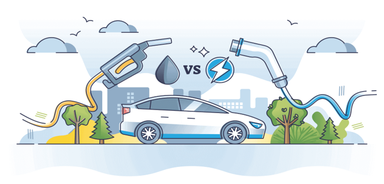
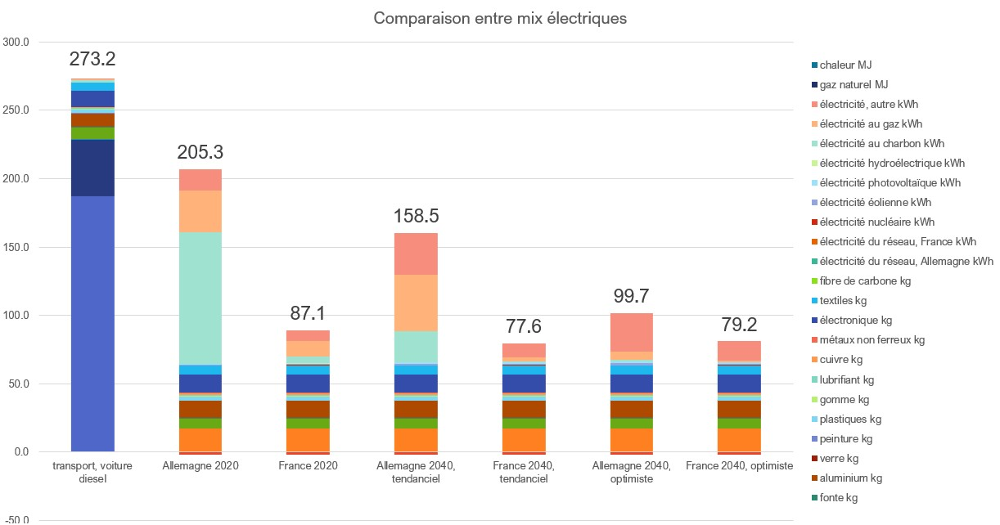

{width=1pt}

## What is Life Cycle Assessment?

Life Cycle Assessment (LCA) is a methodology for quantifying the environmental impacts of a product, service, or technology across its entire life cycle, from raw material extraction to end-of-life disposal. The framework is inherently multi-criteria: rather than reducing environmental performance to a single metric (e.g., CO₂), it simultaneously tracks impacts across categories including climate change, resource depletion, water use, ecotoxicity, and particulate matter formation.

### Why LCA matters for the electric vehicle debate

Media headlines comparing electric and diesel cars frequently contain methodological errors: they either compare only the *use phase* (ignoring production and end-of-life), or they focus on a single indicator (CO₂), or they assume a fixed electricity mix. LCA provides the rigorous counter-framework. The classic misconception: a Tesla advertised as "0 g CO₂/km" is measuring only tailpipe emissions. The battery alone requires roughly **67 kg CO₂ per kWh** to manufacture (EU average, 2020), and a 60 kWh battery therefore embeds ~4,020 kg CO₂ before the car travels a single kilometre.

---

## Context and Objectives

**Case study objective:** Compare the life-cycle environmental impacts of a **diesel internal combustion engine vehicle** against a **battery electric vehicle (BEV)**, under several electricity mix scenarios for France and Germany over 2020–2040.

Three impact indicators are evaluated:

| Indicator | Unit | Captures |
|-----------|------|---------|
| Greenhouse gas emissions | kg CO₂ eq./km | Climate change |
| Primary energy demand | MJ/km | Resource intensity of the energy |
| Abiotic resource depletion (minerals) | kg Sb eq./km | Scarcity of materials (Li, Cu, Fe, Al) |

**Supporting files:**

- [`ENSAE_étude_de_cas.xlsx`](ENSAE_étude_de_cas.xlsx) — Complete solution with all computations

---

## The LCA Framework: Four Phases

### Phase 1 — Goal and Scope Definition

**Functional unit:** *1 km driven by a privately owned car.*

This choice of functional unit is deliberate: it captures the *service delivered* (mobility) rather than the product itself. Comparing "1 diesel car vs. 1 electric car" would be meaningless because the two vehicles have different lifetimes and efficiencies. Normalising to 1 km places them on a common basis.

**System boundary:** The study examines the whole life of the vehicles and includes:

- Raw material extraction
- Vehicle and battery manufacturing
- Use phase (fuel/electricity consumption)
- Maintenance
- End-of-life recycling (battery)

**Scenarios:** France and Germany, in years 2020, 2040 (trend) and 2040 (optimistic), reflecting the progressive decarbonisation of the electricity grid.

**Key vehicle parameters:**

| Parameter | Value |
|-----------|-------|
| Vehicle lifetime | 250,000 km |
| Annual mileage | 15,000 km/yr (→ 16.7 years) |
| Diesel consumption | 7 l/100 km |
| Electric consumption | 18 kWh/100 km + 10% charging losses → 19.8 kWh/100 km |
| Diesel car mass | 1,700 kg |
| EV mass (excl. battery) | 1,600 kg |
| Battery capacity | 60 kWh |
| Annual maintenance | 100 h/yr |

### Phase 2 — Inventory Analysis

The inventory phase constructs a complete mapping of all physical flows between industrial processes and with the natural environment. In matrix algebra terms, the system requires three matrices.

#### Matrix A — The Technology Matrix (Technosphere)

**A** is a 32×32 matrix (32 activities × 32 activities) where entry $A_{ij}$ gives the quantity of output of activity $i$ required to produce one unit of output of activity $j$. Each column is the "recipe" for producing one unit of that activity.

Examples:

- $A_{\text{diesel car, transport diesel}} = 4 \times 10^{-6}$ vehicles/km means one vehicle must be manufactured per 250,000 km driven
- $A_{\text{battery production, transport EV}} = 2.4 \times 10^{-4}$ kWh/km, amortising the 60 kWh battery over 250,000 km
- $A_{\text{diesel, transport diesel}} = 0.07$ l/km (7 l/100 km)
- $A_{\text{maintenance, transport diesel}} = 6.67 \times 10^{-3}$ h/km (100 h/yr ÷ 15,000 km/yr)

**Diesel combustion stoichiometry:**

The average chemical formula for road diesel is C₁₂H₂₄. The balanced combustion reaction is:

$$\text{C}_{12}\text{H}_{24} + 18\,\text{O}_2 \rightarrow 12\,\text{CO}_2 + 12\,\text{H}_2\text{O}$$

Molar mass of C₁₂H₂₄: $12 \times 12 + 24 \times 1 = 168$ g/mol and mass density of $0.85$ kg/l.

CO₂ produced per litre of diesel:

$$\frac{850\,\text{g/l}}{168\,\text{g/mol}} \times 12 \times 44\,\text{g/mol} = \mathbf{2.671\,\text{kg CO}_2\text{/l}}$$

This single coefficient drives the entire use-phase emission of the diesel vehicle.

#### Matrix B — The Biosphere Matrix

**B** maps the 32 industrial activities to 7 elementary flows (direct emissions or resource extractions that cross the boundary between the technosphere and the natural environment):

- CO₂ to air (kg)
- CH₄ to air (kg)
- Primary energy (MJ)
- Lithium extracted from ground (kg)
- Copper extracted from ground (kg)
- Steel consumed (kg)
- Aluminium consumed (kg)

**Notable values per kWh of battery production (EU, 2020):**

| Flow | Value | Implication |
|------|-------|-------------|
| CO₂ | 67 kg CO₂/kWh | 60 kWh battery → 4,020 kg CO₂ embedded |
| Recycling credit | −7 kg CO₂/kWh | Net after recycling: −420 kg CO₂ |
| Primary energy | 1,393 MJ/kWh | Very energy-intensive process |

The negative values in the recycling row reflect system credits: recovering lithium and cobalt from spent batteries avoids the need to mine virgin materials, which is captured as a negative impact.

#### The Leontief Inverse — Capturing the Full Upstream Chain

The matrix **A** contains circular dependencies: producing steel requires electricity, whose infrastructure requires steel. The naive calculation using only direct inputs would under-count impacts. The correct approach solves:

$$\mathbf{x} = \mathbf{y} + \mathbf{A}\mathbf{x}$$

where **x** is the vector of total production outputs and **y** is the vector of final demand (the functional unit). Rearranging:

$$(\mathbf{I} - \mathbf{A})\,\mathbf{x} = \mathbf{y} \implies \mathbf{x} = (\mathbf{I} - \mathbf{A})^{-1}\mathbf{y} = \mathbf{L}\,\mathbf{y}$$

**L** = $(\mathbf{I} - \mathbf{A})^{-1}$ is the **Leontief inverse**. In LCA it captures all orders of upstream requirements:

$$\mathbf{L} = \mathbf{I} + \mathbf{A} + \mathbf{A}^2 + \mathbf{A}^3 + \cdots$$

Each power of **A** represents one additional tier of supply chain: $\mathbf{A}$ gives direct inputs, $\mathbf{A}^2$ inputs-to-inputs, and so on. This series converges when all eigenvalues of **A** lie strictly inside the unit circle, the physical condition that no process can require more of itself (directly or indirectly) than it produces.

**Why this matters numerically:** the simplified direct calculation gives ~228 g CO₂eq/km for the diesel car, while the Leontief calculation yields ~271 g CO₂eq/km. The additional ~43 g comes from upstream cascades, the emissions embedded in producing the steel, aluminium, rubber, electronics, and so on that compose the vehicle. These are invisible without the matrix inversion.

### Phase 3 — Impact Assessment

#### Matrix C — Characterisation

The elementary flows in **e** = **B**(**I** − **A**)⁻¹**y** are physically heterogeneous (CO₂ in kg, CH₄ in kg, energy in MJ, lithium in kg). The characterisation matrix **C** aggregates them into comparable impact indicators using science-based weighting factors:

$$\mathbf{d} = \mathbf{C}\,\mathbf{e} = \mathbf{C}\,\mathbf{B}\,(\mathbf{I} - \mathbf{A})^{-1}\,\mathbf{y}$$

**Characterisation factors used:**

| Elementary flow | GHG indicator (kg CO₂ eq.) | Materials indicator (kg Sb eq.) |
|----------------|---------------------------|-------------------------------|
| CO₂ | 1 | — |
| CH₄ | 28 | — |
| Lithium | — | 1.15 × 10⁻⁵ |
| Copper | — | 1.37 × 10⁻³ |
| Iron/steel | — | 5.24 × 10⁻⁸ |
| Aluminium | — | 1.09 × 10⁻⁹ |

The methane Global Warming Potential of 28 (over 100 years) reflects the higher radiative forcing of CH₄ relative to CO₂. The materials indicator normalises to antimony (Sb) equivalent, reflecting geopolitical supply risk.

### Phase 4 — Interpretation

Phase 4 analyses the results in light of the study's objectives and limitations. Key questions: which activities drive impact? How do results change under different assumptions (sensitivity analysis)? What conclusions are valid within the stated system boundaries?

---

## Results

### Absolute GHG Results (France base case, g CO₂eq/km)

The stacked bar charts in the excel file decompose the 271 g CO₂eq/km for diesel and 79.2 g CO₂eq/km for the EV by contributing activity:

| Activity | Diesel car | EV (France base) |
|----------|-----------|------------------|
| Use phase — fuel/electricity | 187.0 | ~18 |
| Vehicle body production | ~41.3 | ~45.1 |
| Battery net (production − recycling) | — | +14.4 (net) |
| Maintenance | 0.6 | 0 |
| Upstream cascades (Leontief) | ~42 | ~2 |
| **Total** | **~271** | **~79** |

### Sensitivity to Electricity Mix

The electricity mix is the dominant variable for the EV. Results vary dramatically:

| Scenario | GHG (g CO₂eq/km) | vs. diesel |
|----------|------------------|-----------|
| Diesel | 271 | baseline |
| EV — Germany 2020 | 205 | −24% |
| EV — France 2020 | 87 | −68% |
| EV — Germany 2040 trend | 158 | −42% |
| EV — France 2040 trend | 78 | −71% |
| EV — Germany 2040 optimistic | 100 | −63% |
| EV — France 2040 optimistic | 79 | −71% |

**Key driver:** Germany's 2020 electricity mix is dominated by coal (~45%) and gas (~13%), yielding ~700 g CO₂/kWh. France's mix is dominated by nuclear (~66%), yielding only ~113 g CO₂/kWh — six times lower. This single structural difference cuts the EV's use-phase footprint by roughly 80%.

{width=100%}

### Multi-Criteria View: The Materials Trade-off

The GHG picture is not the whole story. Looking across all three indicators:

| Indicator | Diesel | EV (France base) | Winner |
|-----------|--------|------------------|--------|
| GHG (g CO₂eq/km) | 271 | 79.2 | **EV** |
| Primary energy (MJ/km) | 4.02 | 1.03 | **EV** |
| Abiotic materials (µg Sb eq/km) | 0.21 | 0.51 | **Diesel** |

The EV requires **2.4× more critical materials per km**, almost entirely driven by the lithium-ion battery. Per kWh of battery, the production process extracts:

- ~8 kg of lithium
- ~0.5 kg of copper
- Minor amounts of cobalt, nickel, manganese

The battery recycling process (credited as −7 kg CO₂/kWh) does **not** recover all materials efficiently at current industrial scales, which is why the materials depletion impact remains positive even after the recycling credit.

This illustrates the core LCA concept of **pollution transfer between impact categories**: reducing CO₂ emissions (via electrification) increases pressure on mineral resources. An LCA that tracks only CO₂ would miss this entirely.

---

## Analysis and Critical Discussion

### What drives the result for each vehicle?

**For the diesel car:** the use phase dominates. The 187 g CO₂/km from combustion alone is ~69% of the total. Combustion is essentially non-negotiable for an ICE vehicle, so there is little room for improvement without changing the fuel type. The remaining ~84 g come from upstream material production — reducing the vehicle's mass or increasing recycled content offers marginal gains.

**For the electric vehicle:** three factors determine the outcome:

1. **Electricity carbon intensity** — the single largest lever by a wide margin. Moving from Germany 2020 (700 g CO₂/kWh) to France 2020 (113 g CO₂/kWh) saves ~117 g CO₂/km, more than the entire manufacturing footprint of either vehicle.
2. **Battery size** — the 60 kWh battery embeds ~16 g CO₂eq/km in production (net of recycling). A smaller battery (e.g., 30 kWh for urban use) halves this.
3. **Vehicle body production** — very similar between diesel and EV bodies due to comparable mass and material composition, with the EV slightly heavier in aluminium (for thermal management) and copper (for the motor and wiring).

### When does the EV "break even" on GHG?

The EV starts with a carbon debt relative to the diesel car (more manufacturing emissions, primarily from the battery). In Germany 2020, the per-km EV saving is only 66 g CO₂eq/km. The break-even mileage is approximately:

$$\text{Breakeven} \approx \frac{\Delta \text{production emissions}}{\Delta \text{use-phase savings per km}}$$

A rough estimate: the EV's extra production overhead is ~3,000–5,000 kg CO₂ (dominated by the battery). At 66 g CO₂/km saving, this is paid back after ~45,000–75,000 km — well within the 250,000 km vehicle lifetime.

In France, the saving is ~184 g CO₂/km per km, giving a breakeven of ~16,000–27,000 km — roughly one to two years of driving.

### Sensitivity of the materials result

The materials result is particularly uncertain because:

- Characterisation factors for critical minerals (lithium, cobalt) are based on resource reserves and geopolitical supply risk assessments, which change over time and methodology
- Recycling efficiency of lithium batteries is improving rapidly (currently ~50–70% Li recovery; next-generation hydrometallurgy targets >90%)
- The denominator (vehicle lifetime) matters: a battery that is reused in stationary storage after its automotive life effectively amortises its material footprint over many more cycles

### Limitations of this study

1. **Static electricity mixes:** the model uses a single annual-average mix, not the marginal mix at the time of charging. Charging at night in Germany (when gas peakers are more common) has a higher impact than daytime charging (more wind and solar).
2. **Temporal scope:** 2040 projections rely on scenario modelling with significant uncertainty. The optimistic scenario assumes aggressive renewable deployment.
3. **Single battery life:** the study assumes the battery lasts for the full vehicle lifetime (250,000 km). If the battery degrades and requires replacement (typical for older BEV designs), the material impact roughly doubles.

---

## Conclusions

Across the three indicators evaluated:

- The **EV is strictly better on GHG and primary energy** under all scenarios, but the advantage ranges from very small (Germany 2020, coal-heavy grid) to very large (France 2020 or 2040 optimistic, low-carbon grid).
- The **EV is strictly worse on critical material depletion**, and this gap persists even after recycling credits. This is the textbook example of why multi-criteria LCA is necessary: a single-indicator analysis misleads.
- **The electricity mix is the dominant variable** for the EV. Policy choices about the energy transition (nuclear vs. renewables, pace of coal phase-out) have a larger impact on the EV's environmental performance than any vehicle design choice.
- The materials trade-off will progressively diminish as battery technology improves (higher energy density → less material per kWh) and recycling infrastructure matures.

The study confirms that framing the electric vehicle debate as "zero emission" is misleading, but also confirms that the lifecycle carbon advantage of EVs is real and substantial in low-carbon electricity markets.

