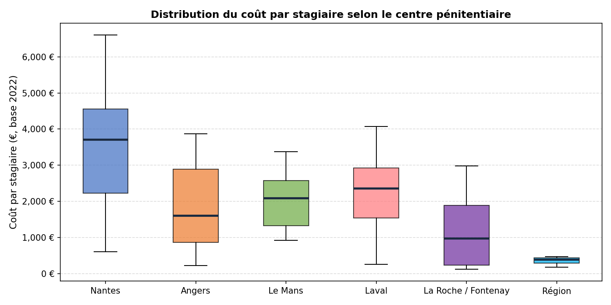
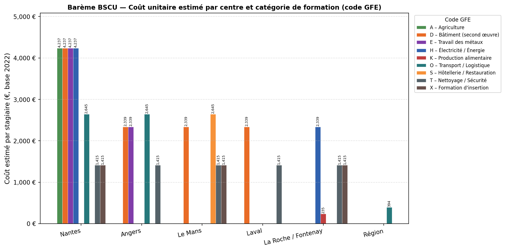
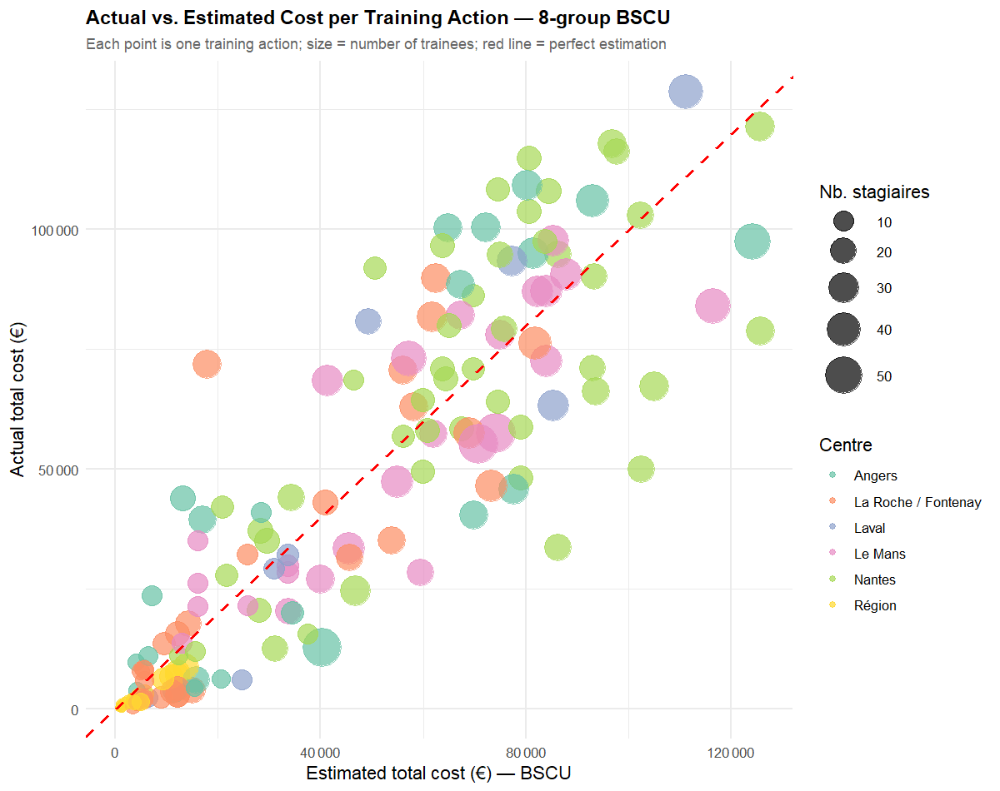

This page presents the main technical work from my internship at the **Direction des Politiques Européennes (DPE)** of the **Conseil Régional des Pays de la Loire**, in Nantes, from June to September 2024. The mission was to build a statistical pricing grid — a *Barème Standard de Coûts Unitaires* (BSCU) — for the vocational training programs organized inside the six prisons of the Pays de la Loire region.



### Why This Matters: European Funds and the Audit Problem

The European Union co-finances regional development projects through several funds. In Pays de la Loire, the 2021–2027 European program mobilises **625 million euros**, of which 64.5M€ comes from the **European Social Fund (FSE+)**. The FSE+ focuses on employment, training, and social inclusion.

When public money is spent on a project — say, a training program for prisoners — the spending authority must prove to the European Commission that every euro was justified. In practice, this means auditors check every invoice, every timesheet, and every attendance record for every trainee in every training session. For a region managing dozens of training contracts across six prison facilities over multiple years, this is an enormous administrative burden.

The EU allows a way out through **Simplified Cost Options (Options de Coûts Simplifiés, OCS)**. Instead of verifying each actual expense, the region can pre-agree on a standard flat rate per trainee and per type of training. Once that rate is validated by the European Commission, reimbursement becomes automatic: if 20 trainees completed a welding program at Nantes, the region gets reimbursed $20 \times \text{rate}$ without needing to justify each individual hour. This makes audits dramatically faster and more reliable. Building such a rate table from historical data is exactly what a BSCU does.

### The Prison Vocational Training Program

Since the **Law of 5 March 2014**, French regions are responsible for funding and organising vocational training inside public penitentiary establishments. The rationale is straightforward: giving prisoners a certified trade or skill during their sentence significantly improves their chances of finding employment after release — which in turn reduces recidivism. Training therefore serves a dual purpose: it provides individual social mobility and generates a broader public safety benefit.

The Pays de la Loire region funds training in six facilities:

| Facility | City | Type |
|---|---|---|
| Centre de détention | Nantes | Long sentences (CD) |
| Maison d'arrêt | Angers | Remand / Short sentences |
| Maison d'arrêt | Le Mans | Remand / Short sentences |
| Maison d'arrêt | Laval | Remand / Short sentences |
| Maison d'arrêt | La Roche-sur-Yon / Fontenay-le-Comte | Remand / Short sentences |
| Régional (CACES) | All sites | Forklift certification, multi-site |

This program falls under **EU priority 4 "A more social region"**, specific objective ESO4.7: *promoting lifelong learning and flexible upskilling*. Because the FSE+ co-finances these training sessions, the BSCU would replace expensive per-receipt audits with a simple per-trainee flat rate, saving significant administrative time on both the regional and European sides.

### The Data

The dataset covers **148 training actions** carried out from 2019 to 2024 across the six facilities, representing **2,891 trainees** and a total expenditure of approximately **6.7 million euros**. Each row in the data is one training action (a contract between the region and a training provider for a specific type of program at a specific facility in a given year). The key variables are:

- **`Centre_final`**: which of the six facilities hosted the training
- **`code_gfe`**: a letter code classifying the type of training (the *Groupe Formation Emploi*, or GFE — agriculture, construction, metalwork, transport, etc.)
- **`nb_stag`**: number of trainees who attended
- **`cout_tot`**: total cost of the action (in euros)
- **`prix_h`** and **`nb_h`**: hourly rate and number of hours (from which the total cost is derived)

The target variable is the **cost per trainee**, computed as total cost divided by number of trainees. To make costs comparable across years, all amounts are normalised to a **2022 base** using the Syntec price index published by INSEE (which tracks price changes in the training services sector): 2021 values are deflated by a factor of 275/277.5, and all other years by 287.9/277.5.

The cost distribution by facility is quite spread out, reflecting real structural differences between centers:

{width=100%}

Nantes stands out with the highest median cost per trainee. This makes economic sense: the Nantes detention center runs longer, full-certification programs (300–700 hours leading to a *Titre Professionnel*) with more qualified instructors, whereas remand prisons like Laval or La Roche run shorter modules for a more transient population. The regional CACES forklift program has very low per-trainee costs because a single session serves trainees from multiple facilities at once, spreading fixed costs across many participants.

### Step 1 — Identifying the Relevant Variables

The first question is: what actually drives the cost per trainee? An ordinary least squares (OLS) linear regression of the cost per trainee on all available variables — facility, year, number of trainees, total cost, hourly rate, hours, training provider, and training type (code GFE) — gives a first picture of which factors matter.

The regression reveals that the most informative predictors are the **facility** (`Centre_final`), the **training type** (`code_gfe`), and the **training provider** (`org_form`). A weighted OLS using just `Centre_final` and `code_gfe` already explains **R² = 0.584** of the variance in cost per trainee, meaning these two variables alone account for about 58% of the cost differences across training actions. Adding the provider improves fit further but at the cost of practical usability, since auditors would then need to verify the provider identity for each reimbursement — partially defeating the simplification goal.

A **Fisher test** on the facility variable confirms that the differences in average costs between the six centers are statistically significant and not random noise: the between-group variance is large relative to the within-group variance, so the facility genuinely matters for predicting the cost.

### Step 2 — Building the Groups with CART

Once the key variables are identified, the next question is: what is the best way to group the possible (facility × training type) combinations into a small number of groups, each with a single flat rate? A CART model (**Classification and Regression Trees**) does exactly this.

CART is a decision-tree algorithm that recursively splits the data into groups to minimise a cost function — here, the weighted sum of squared differences between the actual cost per trainee and the group mean. The weights are the number of trainees, so a training action with 30 participants counts 30 times more than one with a single trainee.

The full tree is first grown to its maximum complexity, then **pruned** using a cost-complexity parameter: branches that contribute only a tiny improvement in fit are removed. The result is a tree with **6 distinct price groups**, which balances statistical precision with practical simplicity.

The 6 groups and their estimated cost per trainee (in 2022 euros) are:

| Group | Facilities | Training types | Estimated cost / trainee (€, 2022 base) |
|---|---|---|---|
| 1 | La Roche / Fontenay | Food production (K) | 235 € |
| 2 | Région (CACES only) | Transport / Forklift (O) | 394 € |
| 3 | All centers | Hygiene & Security (T), Insertion training (X) | 1,415 € |
| 4 | Angers, Laval, Le Mans | Construction (D), Metal (E), Electricity (H) | 2,339 € |
| 5 | Angers, Le Mans | Transport & Logistics (O), Hospitality (S) | 2,645 € |
| 6 | Nantes | Agriculture (A), Construction (D), Metal (E), Electricity (H) | 4,237 € |

The same result visualised by facility and training type:

{width=100%}

A few patterns are worth noting. First, **Nantes consistently costs more** for technical trades: the facility operates full-length professional certification programs (often 600+ hours) versus the shorter modules run at remand prisons, and the training provider charges higher hourly rates for these more intensive programs. Second, **cleaning and insertion training (T and X) are cheap across all centers** because these programs are short, high-density sessions where many trainees attend with minimal equipment or instruction cost per person. Third, **the regional CACES forklift training** is extremely cheap per trainee because a single instructor certifies trainees from multiple facilities simultaneously — a classic economy of scale that the CART algorithm correctly identifies as its own group.

### Step 3 — Measuring the Estimation Error

A BSCU is only useful if it is reasonably accurate. The total actual expenditure across all 148 training actions is **6,719,644 €**. The BSCU with 6 groups estimates **6,584,096 €**, a global difference of **−135,548 € (−2.0%)**. This slight under-estimation is primarily driven by the cost inflation of 2022–2024 (new public procurement contracts were repriced upward post-COVID), which the 2022-base normalisation does not fully absorb for 2023 and 2024 actions.

The scatter plot below compares actual and estimated costs action by action (each point is one training action; point size reflects the number of trainees):

{width=100%}

Most points sit close to the red dashed line of perfect estimation. The main sources of error are a handful of actions with unusually small or large cohorts in 2024, where the per-trainee cost deviates significantly from the group average — exactly the kind of outlier that a flat-rate system is not designed to handle but that is acceptable for the purposes of EU reimbursement, as long as the global error over a program period remains low.

### Broader Context

This work sits at the intersection of **public economics** and **social policy**. From a public finance perspective, the BSCU is a tool for reducing transaction costs in a principal-agent relationship: the European Commission (principal) cannot directly observe how regional funds are spent in each prison, and verifying every invoice is expensive. A pre-validated flat rate changes the contract structure — it shifts the risk of under- or over-spending from the EU to the region, but in exchange removes the verification burden. This is a well-studied mechanism in the economics of public contracts and is broadly similar to prospective payment systems used in healthcare (e.g., DRGs in French hospitals).

From a **social science** perspective, the variation in costs across facilities reflects deeper structural inequalities in the prison system. The Centre de détention in Nantes, which holds long-sentence inmates, can offer sustained, accrediting programs and invest in qualified instructors precisely because the population is stable enough to complete a 600-hour program. Remand prisons face constant turnover, shorter stays, and less predictable enrollment — which constrains what kind of training is feasible and pushes providers toward shorter, cheaper modules. The BSCU, by pricing these differences into a grid, implicitly acknowledges that meaningful vocational training for prisoners serving longer sentences genuinely costs more — and that the European co-financing system should fund that difference rather than penalise it through uniform pricing.
