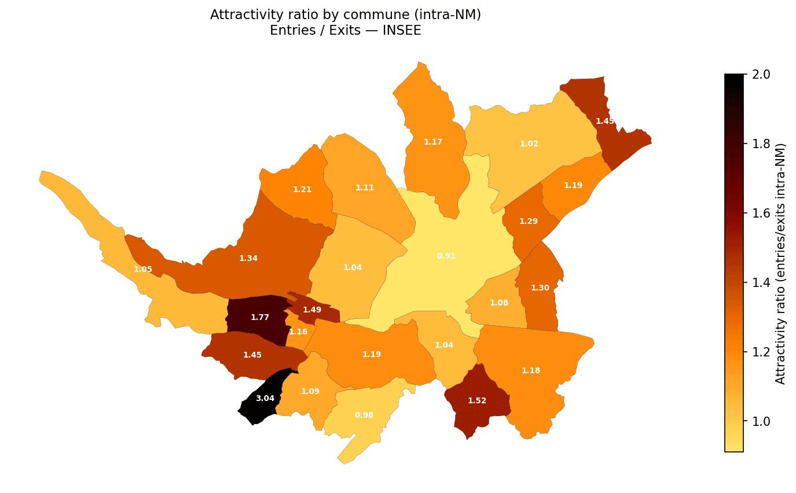
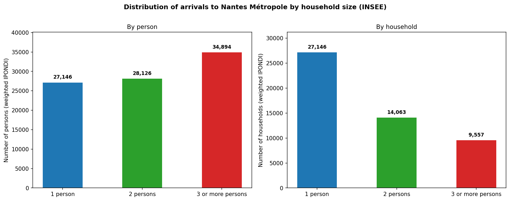
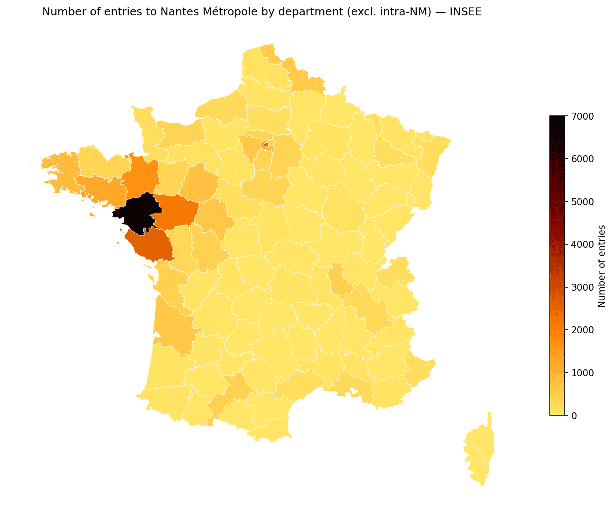
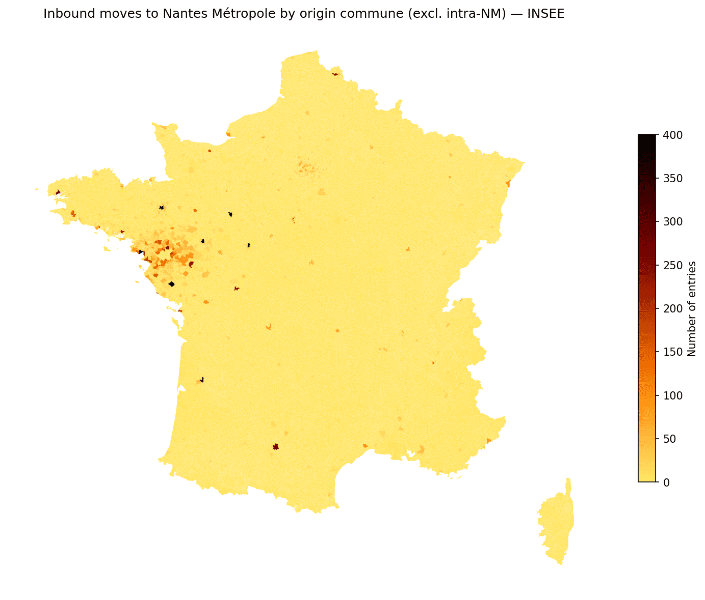
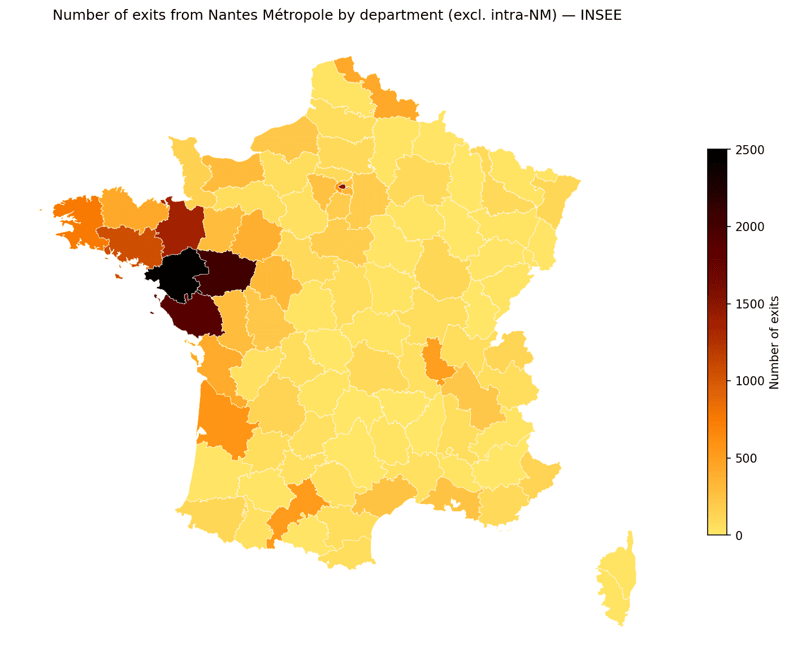
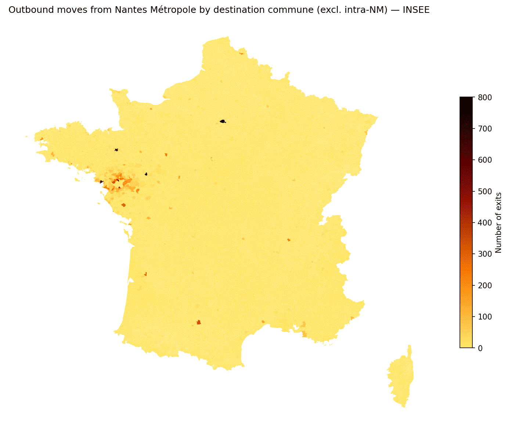
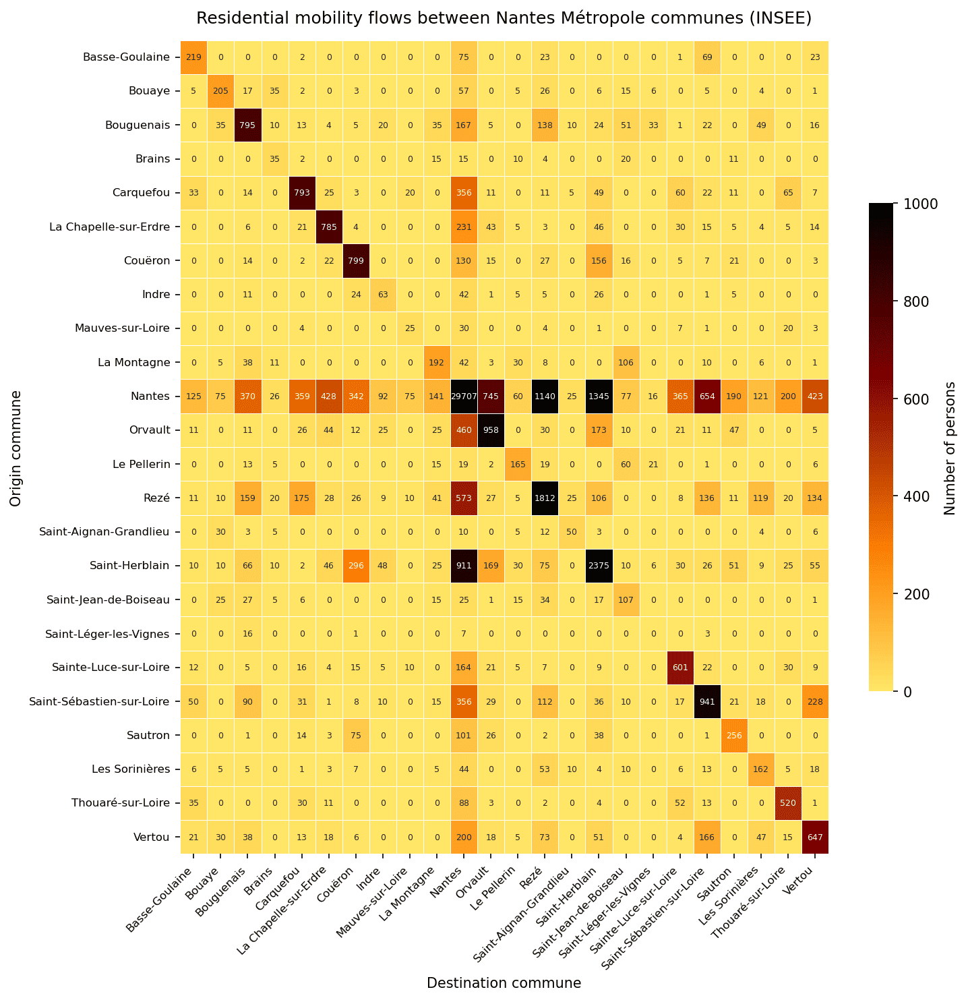
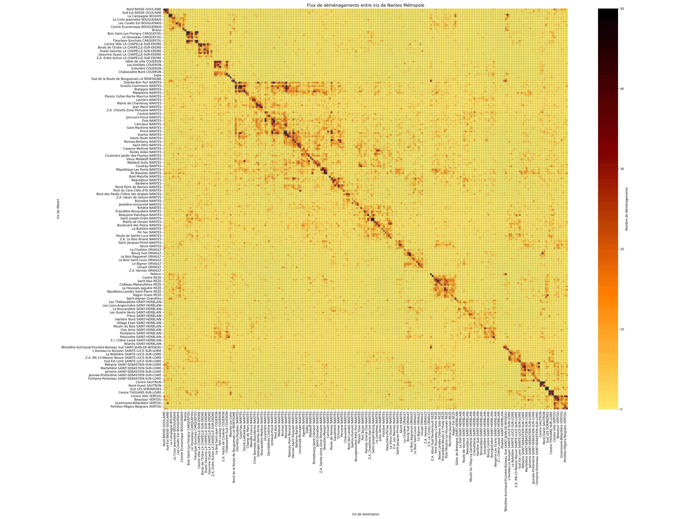
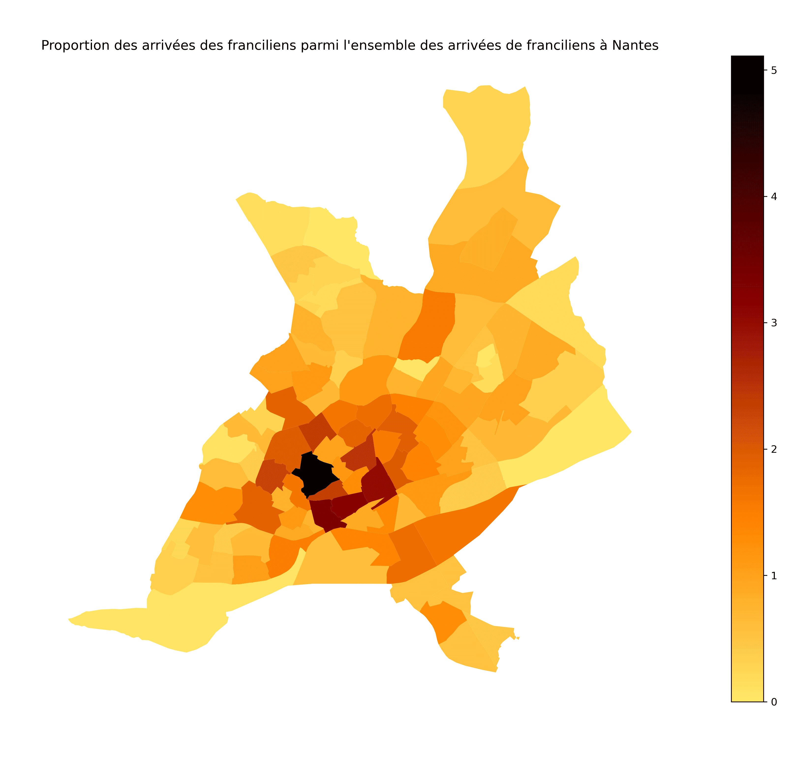

{width=1pt}

## Introduction

This analysis examines residential mobility patterns in **Nantes Métropole (NM)**, a metropolitan authority grouping 24 communes in the Loire-Atlantique department of western France. Understanding who moves, from where, and to which part of the metropolis is central to the work of the Observatoire de la Population at Nantes Métropole's Direction de la Géographie et de l'Observation, which produces demographic dashboards and reports for internal policy use.

Two principal data sources exist for studying residential mobility in France. The first is the **INSEE Recensement de la Population (RP)**, a rolling survey that pools five annual waves (each covering roughly 8% of the population) to produce estimates for a given year *n* using waves from years *n−2* to *n+2*. It operates at the commune level and, for mobility, relies on the *Fichier Détail Migrations Communales* (FD_MIGCOM), which records, for each individual surveyed, their current commune and their commune of residence one year prior. The second source is the **La Poste mail-forwarding contract database**, which captures residential moves through official change-of-address contracts. La Poste's data has two important advantages over INSEE: it is temporally more precise (annual rather than a five-year rolling average), and it is spatially finer — it reaches the **IRIS level** (*Îlots Regroupés pour l'Information Statistique*), the smallest sub-communal geographic unit in France, rather than the commune level.

However, La Poste itself acknowledges that only about 60% of actual moves are captured by forwarding contracts, due to the rise of paperless administration and non-subscription. The underlying microdata of the La Poste database is confidential and cannot be shared or replicated externally. **This analysis therefore relies exclusively on the INSEE RP 2020 data**, which is publicly available. Where relevant, results from the La Poste source are presented as additional context in the final section, using figures from an internal study conducted at Nantes Métropole, but these cannot be reproduced independently.

The analysis proceeds as follows. We first describe the data and methodology used to extract and weight the mobility flows. We then examine the distribution of household size among movers, the geographic origins of incoming flows at both the département and commune level, the geographic destinations of outgoing flows, and finally the internal dynamics of the metropolis through an attractivity ratio and an inter-communal flux matrix.

---

## Data and Methodology

### Source: FD_MIGCOM 2020

The raw file used is <a href="https://www.insee.fr/fr/statistiques/fichier/7637869/RP2020_migcom_csv.zip" target="_blank">FD_MIGCOM_2020.csv</a> (<a href="https://www.insee.fr/fr/statistiques/7637869?sommaire=7637890" target="_blank">Publication link rather than direct download</a>), the detailed individual file for communal migrations from the INSEE RP 2020 rolling census. It contains approximately 3.9 million individual records (unweighted) and is roughly 2 GB in size on disk. Each record corresponds to one surveyed individual and includes:

- `COMMUNE` — the commune of current residence (5-digit INSEE code)
- `DCRAN` — the commune of residence one year prior (`99999` = abroad)
- `IRAN` — migration type indicator: `1` = non-mover (same dwelling), `2` = intra-communal mover, `3` = inter-communal within same département, `4` = inter-communal across départements, `5` = from abroad
- `IPONDI` — the individual survey weight, which extrapolates each record to the full French population
- `NPERR` — household size (capped at 6 persons)

Only records with `IRAN ≠ 1` are retained — that is, only individuals who changed dwelling in the year preceding the census. The sum of `IPONDI` over all retained records in the Nantes Métropole perimeter yields the estimated total number of residential moves, which corresponds to approximately **98,672 entries** into the metropolis according to the 2020 census.

### Defining Nantes Métropole

Nantes Métropole comprises **24 communes**, identified by their INSEE codes beginning with `44`. The perimeter used in this analysis is:

| Code | Commune | Code | Commune |
|------|---------|------|---------|
| 44009 | Basse-Goulaine | 44120 | Le Pellerin |
| 44018 | Bouaye | 44143 | Rezé |
| 44020 | Bouguenais | 44150 | Saint-Aignan-Grandlieu |
| 44024 | Brains | 44162 | Saint-Herblain |
| 44026 | Carquefou | 44166 | Saint-Jean-de-Boiseau |
| 44035 | La Chapelle-sur-Erdre | 44171 | Saint-Léger-les-Vignes |
| 44047 | Couëron | 44172 | Sainte-Luce-sur-Loire |
| 44074 | Indre | 44190 | Saint-Sébastien-sur-Loire |
| 44094 | Mauves-sur-Loire | 44194 | Sautron |
| 44101 | La Montagne | 44198 | Les Sorinières |
| 44109 | Nantes | 44204 | Thouaré-sur-Loire |
| 44114 | Orvault |  44215 | Vertou |

Three analytical sub-datasets are constructed:

- **`NM_enter`** — flows *arriving* in NM (current commune `∈ NM`, regardless of origin)
- **`NM_leave`** — flows *departing* from NM (previous commune `∈ NM`, regardless of destination)
- **`NM_intra`** — flows *internal* to NM (both current and previous commune `∈ NM`)

Given the file size, data is processed in 500,000-row chunks to avoid memory overflow, filtering by commune codes during ingestion. All flow volumes reported below are weighted sums of `IPONDI`.

---

## Household Size Among Movers

A first descriptive question is: what is the typical household size of people who move? This matters because mobility patterns differ significantly between single-person households (often younger, more mobile individuals — students, young professionals) and larger family units.

{width=100%}

The figure shows two complementary views of the `NPERR` distribution among all entries into Nantes Métropole: the left panel counts individual persons, and the right panel counts distinct household contracts (i.e., treating each household as one unit regardless of size). The two distributions are not identical precisely because larger households contribute more individuals per move.

About **half of all incoming movements** involve single-person households, consistent with the dominant role of young adults and students in residential mobility. Two-person households account for roughly 30% of moves, and households of three or more make up the remaining ~20%. This structure is sociologically coherent: single-person movers often correspond to life transitions (entry into higher education, professional relocation, end of a relationship), which are more frequent and less anchored to a specific territory than the moves of families, who tend to relocate less frequently and over shorter distances [@courdescomptes2025].

From a data quality standpoint, this distribution also matters when comparing with the La Poste source: La Poste contracts systematically under-represent single and two-person households, capturing only about a third of their moves, while larger households are better represented (nearly half their moves are captured). This structural bias in the La Poste data is partly due to the increasing paperlessness of younger, more connected populations, who are less likely to formalise a change of address through the postal service [@arcep2017].

---

## Geographic Origin of Incoming Flows

### At the Département Level

Where do people who move to Nantes Métropole come from? The map below shows incoming flows by département of origin, excluding internal NM moves.

{width=100%}

The geographic pattern is clear and consistent with France's territorial dynamics. The dominant sources of incoming residents are:

- **Île-de-France** (Paris region) stands out as the most visible distant source, with Seine (75), Hauts-de-Seine (92) and Val-de-Marne (94) all showing elevated flows. This west-bound migration has been documented in the literature and is commonly attributed to lower housing costs, perceived quality of life, and the region's economic dynamism — particularly attractive to families and young professionals priced out of the Paris market [@arthurloyd2021].
- **Neighbouring départements** in the Grand Ouest: Loire-Atlantique itself (communes outside NM), Maine-et-Loire (49), Vendée (85), Ille-et-Vilaine (35) and Morbihan (56). This reflects a strong regional mobility logic — people moving within their broader labour market area, driven by housing affordability, family ties, or professional relocation within the same economic basin [@observatoire2018].

The map confirms a gradient of proximity: the further from Nantes, the fewer arrivals, with the notable exception of Île-de-France.

### At the Commune Level

Zooming in to the commune scale reveals the same structure in finer granularity:

{width=100%}

The concentration around Nantes itself and its first ring of communes is expected — a large share of intra-NM mobility involves Nantes as either origin or destination. Beyond the metropolis, the densest corridors come from cities such as Saint-Nazaire, La Roche-sur-Yon, Angers, Rennes, and Paris, reflecting both proximity and urban connectivity.

---

## Geographic Destination of Outgoing Flows

### At the Département Level

People leaving Nantes Métropole also follow a predominantly western orientation:

{width=100%}

Outgoing flows are even more geographically concentrated than incoming ones: the great majority of leavers relocate to other communes of Loire-Atlantique or to the immediate neighbouring départements (Vendée, Maine-et-Loire, Ille-et-Vilaine). This is consistent with a pattern of **territorial anchoring**: people who leave the metropolis do not typically break away from their broader life context; they relocate within an area they know, for reasons of housing accessibility, family proximity, or professional reconversion in less dense environments [@observatoire2018].

The Île-de-France receives a visible but modest share of outflows — broadly symmetric to what it sends, which suggests that NM–Paris residential exchanges, while real, are relatively balanced and do not represent a systematic drain in either direction.

### At the Commune Level

{width=100%}

At commune level, outflows mirror inflows in their geographic shape. The dominant destinations outside NM are the same cities that send the most arrivals: Saint-Nazaire, Angers, Rennes, and the Paris agglomeration. This reinforces the reading that Nantes Métropole is deeply integrated into a regional network of cities, exchanging residents bilaterally rather than functioning as a pure attractor.

---

## Internal Dynamics of Nantes Métropole

### Attractivity Ratio by Commune

Once we focus exclusively on moves that are **internal to the metropolis** (both origin and destination within NM), a useful summary statistic is the **attractivity ratio**, defined for each commune as the number of intra-NM arrivals divided by the number of intra-NM departures. A ratio above 1 means the commune gains more residents from within the metropolis than it loses; below 1 it loses more than it gains.

{width=100%}

The result is counter-intuitive at first glance: **Nantes, despite concentrating the largest absolute number of moves, has one of the lowest attractivity ratios in the metropolis** — approximately 0.91 intra-NM entries per departure. This is a well-known urban phenomenon sometimes called *expulsive centrality* [@observatoire2018], [@popsu2022]: Nantes acts as the primary hub for residential mobility, receiving large external flows and generating large internal ones, but a significant share of those internal flows are outward — households pushed toward the periphery by housing costs, congestion, and the aspiration for more space.

The communes that most consistently gain from internal mobility are peripheral and semi-rural: Brains, Le Pellerin, Saint-Aignan-Grandlieu, and Saint-Léger-les-Vignes show the highest ratios, often exceeding 1.5. These are exactly the communes that benefit from the diffusion of families from Nantes toward cheaper, more spacious environments — a pattern driven by real estate price pressure at the urban core, the search for individual housing among households starting a family, and improved road connectivity making longer commutes more feasible [@madore2022].

### Intra-NM Flux Matrix

The most granular representation of intra-metropolitan mobility is the **24×24 origin–destination matrix**, where cell (i, j) records the weighted number of individuals who moved from commune i to commune j within a single year.

{width=100%}

Several patterns emerge immediately:

- **The diagonal is the darkest stripe in the matrix.** This corresponds to *intra-communal* moves (changing dwelling within the same commune), which are by far the most frequent type of move for most communes. People overwhelmingly move short distances.
- **The Nantes row and column dominate.** Nantes (row/column 9 from the left in the sorted matrix) has the highest values in nearly every direction, reflecting its role as the metropolis's central node. It both sends and receives more residents than any other commune.
- **A cross (+) structure is visible**, centred on Nantes. This is consistent with the finding that moves not involving Nantes tend to be intra-communal or between geographically adjacent communes, while Nantes is involved in nearly all longer-distance intra-NM flows.
- **Off-diagonal intensity drops sharply.** Flows between peripheral communes (say, Bouaye and Mauves-sur-Loire) are essentially negligible. Residential mobility in the metropolis is strongly mediated by Nantes.

---

## Origin Composition by Commune

Beyond the geographic maps, it is instructive to look at the **composition of incoming flows** for each commune — that is, what share of new arrivals come from within the same commune, from Nantes, from the rest of NM, from elsewhere in Loire-Atlantique, from Île-de-France, and from the rest of France or abroad. The six categories used are:

1. **Intra-communal** (same commune, different dwelling)
2. **From Nantes** (to all other communes)
3. **From NM** (excluding Nantes and excluding the commune itself)
4. **Loire-Atlantique outside NM**
5. **Île-de-France**
6. **Rest of France and abroad**

<iframe
  src="origin_distribution.html"
  width="100%"
  height="700"
  frameborder="0">
</iframe>

This stacked proportion chart (produced interactively in the accompanying notebook using Plotly) reveals that for most peripheral communes, the dominant single source is Nantes — typically 30–50% of all incoming moves. This confirms the diffusion model: Nantes continuously emits residents toward the periphery, primarily families looking for space, while also attracting large flows from outside the metropolis entirely. The Île-de-France share remains modest for every commune, typically 5–10%, which is an important corrective to the public discourse around a massive "Parisian exodus" toward Nantes.

---

## Conclusion

This analysis, based on the INSEE RP 2020 FD_MIGCOM file and restricted to the 24 communes of Nantes Métropole, yields several robust findings:

The mobility landscape of Nantes Métropole is fundamentally **local and regional in character**. The vast majority of movers come from or go to neighbouring communes and départements. Long-distance flows, including from Île-de-France, are real but quantitatively modest — their visual salience on maps is partly a cartographic effect that amplifies geographically concentrated origins.

**Nantes plays a structurally paradoxical role**: it is both the most active commune in terms of total mobility volume and one of the least attractive in the intra-metropolitan ratio. This reflects the urban economic logic of an expulsive centre, where housing costs and density push households — especially families — toward the periphery.

**Household size is a key segmentation variable** for residential mobility. Single-person movers are dominant in absolute number, driven by life transitions characteristic of younger demographics, while families move less frequently but over slightly longer distances and with greater permanence.

**Data limitations are important to keep in mind.** The INSEE RP captures a rolling five-year average rather than a single-year snapshot, and the commune is the finest spatial unit available. As shown in the additional section below, finer-grained analyses at the IRIS level are possible with the La Poste data, which, despite its lower coverage (~40% of actual moves captured), reflects the directional dynamics of the census very faithfully.

---

## Additional Information with La Poste Data

The results presented above are based exclusively on INSEE data, which is publicly available and fully replicable. The following figures come from an internal study conducted at Nantes Métropole using the La Poste mail-forwarding contract database (2021–2024, covering **82,475 persons**). **These figures cannot be reproduced independently** as the underlying microdata is confidential and not publicly distributed.

### Intra-NM Mobility at IRIS Level

The La Poste data makes it possible to go beyond the commune level and examine residential flows at the **IRIS level** — the finest sub-communal geographic unit, typically corresponding to a few hundred to a few thousand inhabitants. The matrix below shows the residential flux between all IRIS of Nantes Métropole:

{width=100%}

This IRIS-level matrix contains substantially more rows and columns than the 24×24 commune matrix, reflecting the several hundred IRIS within the metropolis. Several structures are visible:

- **A strong diagonal** confirms that the most common move is within the same IRIS — ultra-local mobility driven by practical considerations (proximity to work, family, services) and social attachment to one's neighbourhood.
- **Block structures** along the diagonal correspond to the internal matrices of each commune — flows within Nantes, within Saint-Herblain, within Rezé, etc. The block for Nantes is by far the largest, consistent with its dominance in absolute volumes.
- **A clear fragmentation** emerges between IRIS located within Nantes (which show more dispersed mobility patterns, including movements toward peripheral communes) and IRIS in peripheral communes (which show more localised, proximity-driven moves). This suggests that the behavioural drivers of mobility differ systematically by urban position: Nantes IRIS residents are more willing to move across the metropolis, while residents of peripheral communes tend to relocate within their immediate vicinity.

The concentration on the diagonal, with average values around 31% of moves directed toward the same or an immediately adjacent IRIS, quantifies the extent to which residential mobility is fundamentally a local phenomenon even within an already small metropolitan area.

### Proportion of Parisian Arrivals at IRIS Level in Nantes

A recurring public narrative in France positions Nantes as a top destination for Parisians leaving the capital. While this flow is real, the IRIS-level La Poste data allows us to put it in spatial perspective. The map below shows, for each IRIS of Nantes, the proportion of all Parisian arrivals to Nantes that land in that specific IRIS (the proportions sum to 100% across all Nantes IRIS):

{width=100%}

The map reveals that **Parisian arrivals are not uniformly distributed across Nantes — they concentrate in the wealthiest, most central IRIS**. In particular, the IRIS of Monselet (south-east of the historic centre, an area with one of the highest median living standards in the city) stands out as the single most targeted destination for Franciliens. More broadly, the darkest areas correspond to the right bank of the Loire and the prosperous quarters of the centre-south of Nantes.

This spatial selectivity is sociologically significant. It suggests that Parisian migrants to Nantes are not choosing arbitrarily or simply seeking cheaper housing across the board — they are seeking specific urban environments that match a socio-economic standard they are accustomed to. The literature on inter-city migration often frames this as a *quality of life* migration, but the spatial evidence points toward a more nuanced picture: it is a **socially selective** migration toward valorised neighbourhoods, not a diffuse spread across the metropolis.

This finding reinforces the importance of working at the IRIS level when studying residential mobility: at the commune level, Nantes appears as a single destination, masking the very strong internal differentiation in where within Nantes new arrivals from distant regions choose to settle.

---

To run the full pipeline in one place, download the jupyter notebook here: <a href="analyse_mobilites_NM_INSEE.ipynb" download="analyse_mobilites_NM_INSEE.ipynb">analyse_mobilites_NM_INSEE.ipynb</a>.

## References

::: {#refs}
:::
