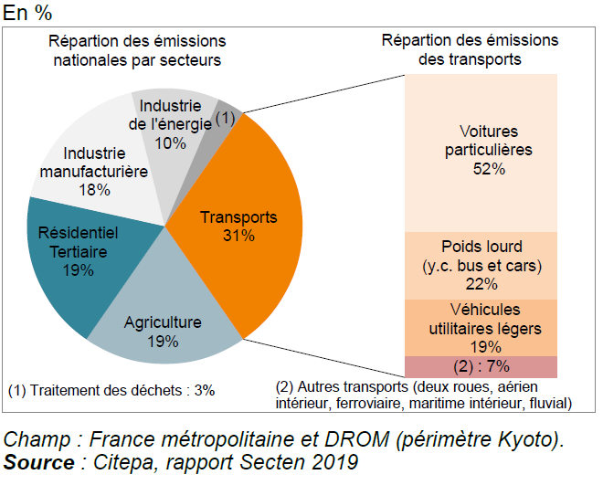

# Presentation of the project

This research paper was produced as part of the Descriptive Economics curriculum at ENSAE Paris. It investigates whether making urban public transport free of charge is a credible policy lever for simultaneously improving service accessibility and reducing greenhouse gas emissions — two objectives that are often presented as naturally aligned, but that the evidence reveals to be in significant tension.

Drawing on French institutional data (Cerema, CITEPA, INSEE, Senate reports) and documented free-fare experiments in cities such as Dunkirk, Aubagne, and Tallinn, the paper maps the financing architecture of French transit networks, analyses the distributional and environmental effects of zero-fare policies, and evaluates the four main alternative funding mechanisms available to local transport authorities. A particular emphasis is placed on the modal shift question: the available evidence consistently shows that free fares attract pedestrians and cyclists far more than car drivers, which substantially limits their net climate impact. The paper concludes with a nuanced policy assessment: free fares are an effective tool for social accessibility in small and medium-sized networks, but an insufficient lever for decarbonisation when deployed without complementary investment in network supply and car disincentive measures.






{width=1%}