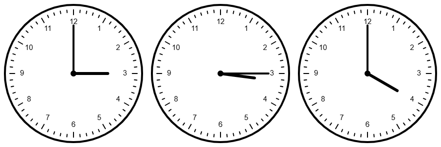

Let's suppose that a clock shows `3:15`, what is the `angle between the minute hand and the hour hand ?`

::: {.callout-tip collapse="true"}
## 💡 Hint

Between 3:00 and 3:15, the hour hand had traveled a bit but how far did it go ?
:::

::: {.callout-tip collapse="true"}
## 💡 Solution

After 15 minutes, the minutes hand had made a quarter of a turn so the angle with the x:00 axis is 90°.

The hour hand made an angle of 90° at 3:00. One hour after, at 4:00, it should be at $\frac {4}{12}*360 = 120°.$ So, in one hour, this hand at turned by 30° (which means $\frac{30}{4} = 7.5°$ each quarter hour). 

Thus, at `3:15, the angle between the two hands is 7.5°`.

{width=900px}
:::

::: {.callout-tip collapse="true"}
## 🚨 Generalisation

This generalisation is more like a follow-up question where we have to compute `the exact time after 3:00 when the two hands overlap`. 

To compute this, we need the angular speed of each hands:
* For the minute one, it takes 60 minutes to do one turn (360°) so we have $v_{min} = \frac{360}{60} = 6 °/min.$
* For the hour one, it takes 12 hours to do one turn so we have $v_{hour} = \frac{360}{12*60} = 0.5 °/min.$

At 3:00, the initial angle of the minutes hand is 0° and the initial angle of the hours hand is 90°. Thus we are trying to solve the equation $0 + 6*t = 90 + 0.5*t.$ We find $\boxed{t=\frac{180}{11} = 16.37 \;min = 16 \; min \; 22 \; s}$ 
:::